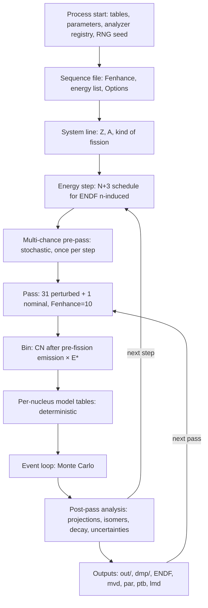
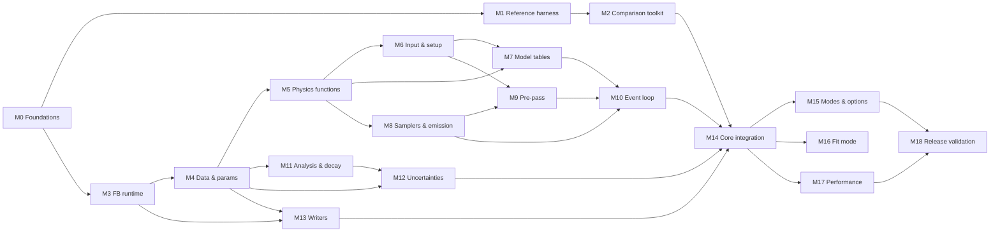

# GEF in C++ — Implementation Strategy

This document describes how the whole project is carried out: what is ported, in what order, how each piece is proven correct, and when the project is finished. It turns `GEF_CPP_VISION.md` into milestones.

Each milestone will get its own plan file (`Planning/MILESTONE_<n>_PLAN.md`, e.g. `MILESTONE_0_PLAN.md`) before work on it starts. Those plans hold the detail; this file holds the structure, the order and the acceptance gates.

Line numbers refer to `Reference/GEF_code/source/` at submodule commit `ba9f0aa` (GEF 2025/1.2).

---

## 1. What we are porting

### 1.1 Shape of the BASIC program

GEF is one FreeBASIC program with no `main` function.

- `GEF.bas` lines 1–15670 are module-level code. Execution runs through `GoTo` labels and `#include` files that are pasted in textually, several of them inside loops.
- Lines 15691–18176 hold about 120 functions.
- About 45k of the ~88k total source lines are `DATA` tables.

One batch run walks this hierarchy:



### 1.2 Component inventory

| Area | BASIC location | What it does | Milestone |
|---|---|---|---|
| FreeBASIC runtime behaviour | implicit (fbc rtlib) | `Rnd`/`Randomize`, float↔int conversion, `Str`, `Print`, `Print Using`, `Format`, arrays with arbitrary bounds, `DATA`/`READ` | M3 |
| Static tables | `NucPropJEFF33.bas`, `DCLbranchingJEFF33.bas`, `BEldmTF.bas`, `BEexp.bas`, `DEFO.bas`, `ShellMO.bas`, `ElmtNames.bas`, `DCLplotting.bas`, `Spectra.bas:798` | Nuclide properties and isomers, decay branchings, masses, shells, deformations, evaluated data for χ² | M4 |
| Parameters | `Parameters.bas`, `GEF.bas:894–1014, 1348–1394, 2575–2622, 5104–5165` | ~100 nominal parameters, 46 perturbed with Gaussian widths | M4, M12 |
| Analyzer framework | `Spectra.bas`, `CLEARspectra.bas`, `CLEARerrors.bas`, `utilities.bi` (`Extend_*`), `GEF.bas:1071–1558` | ~100 histogram arrays, ~113 analyzer registrations, accumulators that grow arrays | M4, M10 |
| Physics functions | `GEF.bas:15814–18051` | Masses, shells, barriers, level densities, temperatures, yields, deformation minimiser | M5 |
| Input and run control | `GEF.bas:1823–3283, 3442–3533` | `file.in`, sequence files, options, energy schedule, output naming | M6 |
| System and step setup | `GEF.bas:3287–3860` | Unbound check, isomers, target and CN spin, CN excitation | M6 |
| Multi-chance pre-pass | `GEF.bas:3882–4800` | Monte Carlo of emission before fission; fission chances | M9 |
| Per-nucleus tables | `GEF.bas:5489–7506` | Mode positions, widths, barriers, yields, polarisation, even-odd, energy sorting, spins | M7 |
| Samplers and emission | `GEF.bas:16650–17092, 17877–18051` | `PGauss` and the other samplers, `Eva` evaporation, gamma sampling, Coulomb acceleration | M8 |
| Event loop | `GEF.bas:7920–9997` | 15 stages from mode choice to the gamma cascade, plus pre-saddle bookkeeping and list-mode output | M10 |
| Post-pass analysis | `GEF.bas:10080–10427, 12772–12903, 14212–14300`, `Branchings.bas`, `Plotting.bas` (χ² only) | Projections, normalisations, isomeric split, decay chains, delayed neutrons, χ² | M11 |
| Uncertainty pipeline | `GEF.bas:10429–11938`, `CovarCUMU.bas` | Per-pass accumulators, mvd round trip, covariances and correlations, final σ | M12 |
| Writers | `GEF.bas:11943–14663, 14844–15465, 15709–15768`, `ENDF.bas`, `DCLendf.bas`, `ENDF_tape_description.bas` | `out/` results file, SATAN `dmp` dumps, ENDF-6 tapes, side files | M13 |
| Options and modes | spread across all of the above | lmd, PTB, RANDOM, COV/COR, two-system covariance, External, ES/EM spectra, other entrance channels | M15 |
| Fit mode | `GEF.bas:2519–2570, 15597–15612`, `Fitpar*.bas`, `ReadParameters.mac` | Random-search parameter optimiser | M16 |

**Not ported** (vision §3):
- the GUI and `Mutex.bas`, screen graphics, the interactive dialogue (`GEF.bas:1909–2517`), `Pfistest.mac` (interactive only);
- the `ctl/` multi-process locking;
- dead code: `GEFSUB`/`GEFRESULTS` at `GEF.bas:7514–7919` (inside a nested comment), the NucProp/branching variants that are not included, `ENDF_EOT.bas`, `Extend.bas`, `E_next`, `Pexplim`, `U_levdens_old`, the `B_EgammaA` branch;
- unused samplers (`PBox`, `PPower`, `PPower_Griffin_E`, `PMaxwellv`).

### 1.3 Facts that drive the strategy

1. **The BASIC numerics are unusual, and they matter for exact comparison.**
   - Most physics runs in `Single`, with `Double` literals and `/` promoting to double.
   - Float→integer conversion rounds half to even. This was confirmed with fbc 1.10.1: `Dim k As Integer = 2.5` gives `2`.
   - `Erf`, `Tanh`, `Min`, `Max` and `Round` are home-made.
   - Some `For` loops step over `Single` values.
2. **Randomness is one global stream.**
   - FreeBASIC's Mersenne Twister is seeded with an LCG fill (`Randomize ,3` at `GEF.bas:1553`, clock-seeded).
   - The stream runs through the pre-pass, the 46 perturbation draws per pass and every event.
   - `PGauss` caches its second value across calls.
   - Almost every event stage uses rejection loops, so the number of draws depends on the data.
   - The lmd option consumes extra draws, so it changes the physics stream.
3. **State leaks across scopes, and outputs depend on it.** Examples:
   - The stale global `Z` decides a parity test in the pre-pass.
   - `E_tunn` and `E_diss_Scission` keep the mode-7 values from the table builder.
   - `EPART`, `PEOZ` and `PEON` are never cleared outside the filled range.
   - `Nmulti2dpre/post` are never cleared within a process.
   - `Isotab.R_lim` is clamped in place.
   - `ctl/IMATmax.ctl` persists across runs.
4. **The code has many quirks and defects, some confirmed against reference output:**
   - The heavy-fragment E1 gammas are lost. `Egamma(N) = Egamma(N) + 1` targets a function, not an array; confirmed to be a silent no-op in fbc 1.10.1.
   - `EdefoA` is always zero.
   - The 100% cap on `d_ZISOPOST` adds instead of setting.
   - `ZApre.dmp`/`ZApost.dmp` rows are written through a file number that has already been closed.
   - Analyzer registry names are mixed up.
   - `MyParameters.dat` has no effect in batch mode.
5. **Covariances are computed from text.**
   - Perturbed-pass yields are written to `tmp/*_Single.mvd`, rounded to 5 decimals or 7 significant digits.
   - The nominal pass reads them back.
6. **Tooling is available locally:**
   - FreeBASIC 1.10.1 at `~/Downloads/FreeBASIC-1.10.1-linux-x86_64` (works; prints harmless `libtinfo` warnings).
   - GCC 16.2, Clang 22, CMake 4.3, Ninja, Python 3 with NumPy and SciPy.
7. **The reference library is version-matched.** `validation/reference/` was produced by GEF 2025/1.2, and a fresh BASIC run agrees with it statistically (independent-yield Poisson z_rms ≈ 1.0 over 59 energies). The BASIC half of the T5 comparison already exists.

---

## 2. Strategic decisions

### 2.1 Fidelity first, through a quirk register

- The C++ code reproduces the BASIC behaviour, including defects.
- Every known departure from "intended" behaviour gets an entry in a **quirk register** (`Planning/QUIRKS.md`, created in M0) with:
  - an ID,
  - the BASIC location,
  - the observable effect,
  - the evidence,
  - the matching C++ symbol.
- In C++ each quirk sits behind a named switch in a `Fidelity` configuration that defaults to "reproduce".
- Fixing a quirk is a separate, later decision, made per quirk with measured impact. It is never folded into a porting milestone.

### 2.2 Two numeric modes, one code base

- **Exact mode (default for testing):**
  - `Single` → `float`, `Double` → `double`;
  - explicit helpers for FreeBASIC conversions (`fb::cint` with round-half-even, `fb::int_` = floor, `fb::fix`, integer `\`);
  - FreeBASIC literal typing (double literals);
  - `Single`-variable `^2` evaluated as `x*x` in `float`; other `^` via `pow`;
  - the custom `Erf`/`Tanh`/`Min`/`Max`.
  - Build flags: `-ffp-contract=off`, no `-ffast-math`, no FMA, glibc libm, x86-64 SSE.
  - This mode is what makes T1 and T3 bit-exact comparison possible. It is the acceptance mode of the whole port (phase 1, §2.9).
- **No "improved precision" mode during the port.** Changing precision is a quirk-level decision taken after release (§2.1).

### 2.3 Random-number architecture

- Every stochastic function takes an explicit `Rng&`. There is no hidden generator.
- `FbMtRng` reproduces FreeBASIC's `Randomize s,3` and `Rnd` exactly: LCG state fill, standard MT19937 twist and tempering, `u32/2^32` as a double.
- `PGaussState` (the cached second value) is an explicit object, owned at the same scope where BASIC's `Static` effectively lives (process-wide).
- **Per-event reseed mode**, available in both the C++ code and the BASIC harness:
  - Before each pre-pass history, each perturbation draw block and each event, the generator is reseeded from (master seed, scope, index), and the `PGauss` cache is reset.
  - This turns T3 from one fragile process-long trajectory into many independent per-event comparisons, so one divergence cannot poison the rest.
- **Parallel mode (M17):** per-event substreams derived from the master seed, so results do not depend on thread count. It is validated statistically (T4) against the exact C++ code, not by trajectory and not directly against BASIC.

### 2.4 State model replaces globals

BASIC's shared globals (about 470 `Dim/ReDim/Static Shared` statements across `GEF.bas` and its includes, plus module-level variables) are mapped to explicit state objects. Each is owned by the scope whose lifetime matches when BASIC actually resets it:

| Scope | Holds | BASIC reset point |
|---|---|---|
| `ProcessState` | tables, the analyzer registry, `IMATmax` additions, `Static Ntimes`, `Nmulti2dpre/post`, mutable `Isotab` fields, leaked "stale" globals (e.g. `Z`) | never |
| `SequenceFileState` | per-file option flags, the frozen lmd file name | per input file (`GEF.bas:2825–2840`) |
| `SystemState` | nominal parameters (Parameters.bas reloaded), naming | per system (`GEF.bas:3320`) |
| `StepState` | energy, CN kinematics, pre-pass results, error accumulators, ENDF state machine | per step (`CLEARerrors`, `GEF.bas:3446`) |
| `PassState` | working parameters (nominal or perturbed), spectra | per pass (`CLEARspectra`, `GEF.bas:4816`) |
| `BinTables` | per-nucleus model tables plus the persistent arrays they overwrite only partly | per bin, with deliberate carry-over |
| `Event` | per-event values handed from stage to stage | per event |

Every leak across scopes is an explicit field, documented in the quirk register.

### 2.5 Data comes from the BASIC sources, never hand-copied

- A converter (`tools/gen_gef_data.py`) applies FreeBASIC's `DATA` lexing rules to the submodule sources:
  - `_` continuation;
  - `'` and `/' '/` comments;
  - labels and quoted strings.
- It emits generated C++ (a token stream plus label offsets).
- A C++ `DataReader` emulates `Restore` and `Read`, including `(float)strtod` for `Single`, reads that cross label boundaries, and the past-the-end value 0.
- Loaders are ported line for line so that their quirks are kept, e.g. BranchData isomer rows overwriting `R_alpha`, and loading stopping at Ra-234.

### 2.6 The reference harness (BASIC side)

The submodule is never edited. The harness:
- copies the sources into a build directory;
- applies versioned patches from `harness/patches/`;
- compiles them with the pinned fbc.

**Patch kinds:**
- **Seed control:** `Randomize <seed>,3` from the environment, plus the per-event reseed mode.
- **Rnd logging:** textual replacement of `Rnd` with a wrapper that logs (site tag, counter, u32). Used to record draw streams for stage-replay tests.
- **Probes:** `#ifdef`-guarded dumps of state at fixed points, written as hex bit patterns. Points:

| Probe | Location | Captures |
|---|---|---|
| T0 | after line 1570 | tables |
| P1 | after 3860 | step setup |
| P2 | after 4800 | pre-pass |
| P3 | at 7920, per bin and pass | model tables |
| — | per event | event-stage records |
| — | after 10427 | projections |
| — | after 10727 | accumulators |
| — | after 11428 | σ and covariances |
| — | after 14300 | isomer probabilities |
| — | Branchings entry and exit | decay inputs and results |
| — | ENDF entry | writer inputs |

- **Function drivers:** standalone FreeBASIC programs that include the table loaders and copies of function bodies (cut by line range), and evaluate them on grids.

**Neutrality rule:**
- Probes and logging must not change control flow or random-number consumption.
- Each patch set is proven neutral: a seeded run with probes must produce byte-identical outputs (timestamps masked) to the same seeded run without probes.
- A patch that fails this check is not used.

**Clean execution:** every reference run uses a fresh working directory, with no stale `ctl/`, `out/`, `ENDF/` or `dmp/`.

### 2.7 Comparison toolkit and statistical calibration

- **Parsers** for:
  - SATAN `dmp` files;
  - the XML-like `out/` sections;
  - ENDF-6 MF1/MF8;
  - `mvd` and `par` files;
  - probe dumps.
- **Exact comparators:** hex/ULP for T0–T3, and text with timestamps masked.
- **Statistical comparators:**
  - Poisson/binomial z-scores computed from the actual event counts;
  - covariance-aware χ² for correlated blocks (cumulative chains, normalised distributions);
  - KS tests for distributions;
  - control of the false-alarm rate across thousands of comparisons.
- **Null calibration:**
  - Phase 1 (§2.9): run BASIC against BASIC with K different seeds to measure the natural spread, including noise common to a whole energy step (e.g. the 18.5 MeV outlier in the test run). In phase 1 statistics are only a diagnostic and the T5 library check. The port is accepted by exact equality.
  - Phase 2: calibrate from the exact C++ code. It is fast enough for large ensembles (K in the hundreds or more). M2 showed that 20 BASIC runs cannot calibrate per-bin tails at the confidence levels a full-output comparison needs (M2 plan, completion notes).
  - A candidate passes when its distance to the reference falls inside the calibrated spread. This is the basis of every statistical acceptance threshold.
- **Sensitivity proof:** planted faults in the C++ build must be detected (vision §4.5).

### 2.8 Proposed C++ layout

The milestone plans may refine this layout.

```
Cpp_implementation/
  CMakeLists.txt
  src/
    fbrt/        FreeBASIC runtime emulation: numerics, FbMtRng, formatting, bounded arrays, DataReader
    data/        generated tables + loaders (NucTab/Isotab, branchings, masses, shells, DEFO, evaluations)
    params/      parameter registry, nominal values, perturbation widths
    physics/     deterministic functions (masses, barriers, level densities, yields, Beta_Equi, ...)
    run/         input parsing, run plan, system/step setup, scope state objects
    prepass/     multi-chance pre-pass
    tables/      per-nucleus model table builder
    event/       samplers, Eva, gamma emission, event stages
    analysis/    histograms + registry, projections, isomers, decay, uncertainties, chi-square
    output/      out/, dmp, ENDF, mvd, par, ptb, lmd writers
    app/         gef CLI
  tests/         unit tests + differential test drivers (C++ side)
harness/
  patches/       versioned patches to a copy of the BASIC source
  drivers/       FreeBASIC function drivers
  scripts/       build, clean-run, probe-capture, reference-store tooling
compare/         parsers, comparators, statistical engine, reports (Python)
tools/           data converter and other generators
```

- Validation artifacts stay outside git (`validation/` is gitignored).
- What is committed: manifests of inputs, seeds, binary hashes and SHA-256 checksums of stored reference outputs.

### 2.9 Two phases: exact reproduction, then optimisation (decision 2026-10-08)

- **Phase 1 (M3–M16): exact reproduction.** Every milestone proves its component bit-exact against BASIC (T0–T3). Integral acceptance is T3: a seeded C++ run in exact mode writes the same output bytes as the seeded `ref-1` run, timestamps masked, in normal mode at production settings.
  - Per-event reseed mode and the `Rnd` draw logs localise divergences.
  - A divergence is a defect. It is triaged to its first differing draw or value and fixed.
  - A divergence that provably cannot be removed needs a written analysis and the user's approval. Its outputs are then judged by T4.
- **Phase 2 (M17 onward): optimisation and improvement.** Performance work, parallel mode and fidelity-switch fixes are judged against the **exact C++ code**:
  - T3 where the random stream is unchanged;
  - T4 where it changes by design.

  The exact C++ code is the oracle from then on: it can be instrumented, rerun and ensembled freely, unlike the BASIC program.
- **Why:** comparing an optimised implementation directly with BASIC requires statistical tests of every output at extreme confidence levels. Those tests can only be calibrated from BASIC runs that are expensive and that the project patches minimally. Exact reproduction makes the port's correctness a yes/no question; statistics are needed only where differences are intended.

---

## 3. Milestones

### Conventions

- **Gate:** the tests listed under "Proven by" must pass before the milestone is closed.
- **Tier labels** follow vision §4.2:
  - T0: data, exact;
  - T1: deterministic functions;
  - T2a: same random stream; T2b: same distribution;
  - T3: seeded trajectory, identical output; the integral acceptance tier of phase 1 (§2.9);
  - T4: statistical integral; phase 2 only, against the exact C++ code;
  - T5: library integral.
- **Probe-fed tests:** a C++ component consumes inputs captured from BASIC probes and must reproduce the BASIC outputs captured at the matching probe. This lets downstream components be built and proven before upstream physics exists.
- **Plans:** every milestone opens with a plan file. It closes with an update to the coverage matrix and the quirk register.

### Dependency graph



Two tracks run in parallel after M5 and meet at M14:
- **Physics track:** M6–M10.
- **Analysis/output track:** M11–M13. It is fed by probe captures and does not wait for the physics.

---

### M0 — Foundations

**Goal:** a project that builds, tests and records decisions, before any physics.

**Plan:** `Planning/MILESTONE_0_PLAN.md`.

**Scope:**
- the `Cpp_implementation/` CMake skeleton (C++23, GCC and Clang);
- compiler flag policy (§2.2), mirroring the gcc flags fbc uses;
- warnings as errors;
- sanitizer and static-analysis builds;
- a unit-test framework;
- a Python tooling environment;
- a CI script that runs everything locally;
- a toolchain check that pins fbc 1.10.1 and records its gcc invocation;
- BASIC-source tooling:
  - FreeBASIC → C translation of `GEF.bas` (`fbc -gen gcc -R`);
  - a line-lookup helper that maps a BASIC line to its generated C through `#line` directives;
  - a case-insensitive ctags symbol index;
- the planning-session code maps saved into `Planning/code_maps/`;
- the coding standards document;
- `QUIRKS.md` and `COVERAGE_MATRIX.md`, seeded with the quirks and coverage cells already known (vision §4.4, this document §1.3);
- the artifact-store convention (manifests in git, data outside git), with SHA-256 manifests for `validation/`.

**Proven by:**
- clean build and test run with both compilers;
- sanitizer build green;
- a floating-point environment self-check, including an FMA negative check;
- the line-lookup tool reproducing known facts (`GEF.bas:8392`, `GEF.bas:9417`);
- a full local CI run.

**Exit:** later milestones can add code and tests, and inspect the exact semantics of any BASIC line, without infrastructure work.

---

### M1 — Reference harness

**Goal:** make the BASIC program a controllable, observable test oracle (§2.6).

**Status:** complete (2026-10-07), see `Planning/MILESTONE_1_PLAN.md`.

**Scope:**
- Build the reference binary from a patched copy of the source with the fbc pinned in M0. Show that it is equivalent to `validation/test_run/gef_reference` **byte for byte**: capture the seed `gef_reference` derives from the clock (gdb), replay it with the seed-patched build, compare all outputs with timestamps masked. The seed-patched build then becomes the reference binary `ref-1`. Emit the patched C with the M0 tooling.
- The patch framework.
- Seed control and per-event reseed mode.
- The `Rnd` logging wrapper.
- The probe framework with hex dumps, and the first probe set (T0, P1, P2, P3).
- The driver framework.
- The clean-run runner.
- The reference store with manifests.

**Proven by:**
1. The seed-patched build reproduces `gef_reference` byte for byte (timestamps masked) for captured seeds, on an `EN` and a `GS` input.
2. Two seeded runs are byte-identical (timestamps masked), in normal and per-event reseed mode.
3. Probe and logging neutrality: probed seeded runs are byte-identical to unprobed seeded runs.
4. An unprobed harness build agrees statistically with `validation/reference/`, using production `Fenhance` and a shortened energy list. The check is minimal and provisional (three-way rule against the library and an independent BASIC run); M2 replaces it with the null-calibrated comparison.
5. A trivial driver (`Randomize 42,3` with 10⁶ `Rnd` values) runs and is stored as the first golden file.

**Exit:** any BASIC quantity named in later milestones can be captured on demand, exactly and repeatably.

---

### M2 — Comparison toolkit

**Goal:** turn "same output" into automated verdicts (§2.7): exact field-level comparison of any two runs, and calibrated statistical verdicts.

**Status:** complete (2026-10-08), with the statistical part re-scoped after the phase decision (§2.9). See `Planning/MILESTONE_2_PLAN.md`.

**Scope:**
- Parsers for `dmp`, `out/`, ENDF MF8, `mvd`, `par` and probe dumps.
- Exact comparators with masks.
- Statistical comparators: Poisson z per bin and per nuclide, discrete low-count tests, multiple-comparison control (Holm).
- Report generation that pinpoints the failing observable, energy and bin.
- A null-calibration workflow from K seeded runs.

**Proven by:**
- The parsers round-trip every file in `validation/test_run/` and `validation/reference/` (G1).
- The exact comparator finds no difference between same-seed runs and reports single-ULP changes (G2).
- For Cf-252, BASIC-against-BASIC runs pass at the designed false-alarm rate (G3), and synthetic faults at or above the minimum detectable effect are detected (G5).
- The M1 G4 exception run passes against the calibration.
- Re-scoped: Rn-215 statistical calibration from 20 BASIC runs does not reach the 1 % false-alarm target. It moves to phase 2, where exact-C++ ensembles can be large.

**Exit:** exact verdicts for any pair of output directories (the phase-1 acceptance tool); statistical verdicts for inputs whose ensembles calibrate (phase 2 and T5).

---

### M3 — FreeBASIC runtime emulation

**Status:** planned (2026-10-08), see `Planning/MILESTONE_3_PLAN.md`.

**Goal:** a C++ library that behaves like the FreeBASIC runtime wherever GEF depends on it.

**Scope:**
- Conversion helpers.
- `Single`/`Double` arithmetic conventions.
- Custom `Erf`/`Erfc`/`Tanh`/`Min`/`Max`/`Log10`/`Round`/`Floor`/`Ceil`.
- `FbMtRng`.
- `Str(Single|Double)`.
- `Print`: comma zones, `Tab`, `;`, the leading space for non-negatives.
- `Print Using` with every template GEF uses.
- vbcompat `Format`: the ENDF patterns, `#####` and timestamps.
- N-d arrays with arbitrary lower bounds, row-major layout and `Extend_*` growth semantics.
- The `DataReader`.

**Proven by:**
- **T1, byte-exact** against FreeBASIC drivers over edge-value grids: ±0, half-way rounding cases, powers of ten, denormals, NaN/Inf, overflow of `Print Using`, negative zero.
- **T2a, bit-exact:** the `FbMtRng` stream against the driver for ≥ 20 seeds × 10⁶ draws, including seed edge values.
- Array growth sequences reproduce BASIC bounds and contents.

**Exit:** no later milestone needs its own formatting or rounding code.

---

### M4 — Static data, parameters and analyzer registry

**Goal:** every table and constant that GEF loads, identical in C++.

**Scope:**
- The data converter (§2.5) for all active tables: NucTab/Isotab (including the spin-sorted `R_lim` windows), BranchData/EndA/INlast, BEldmTF, BEexp, DEFOtab, ShellMO, ElmtNames, the DCLplotting evaluation tables and `ENfrvar_lim`.
- Converter assertions on counts and indices.
- The parameter registry: ~100 nominal parameters with Double-literal → Single narrowing, the last-assignment-wins duplicates, the final `Var_*` widths, and the list of 46 perturbed parameters in draw order.
- The `Anl_Par` analyzer registry including its naming quirks.
- Table lookup functions: `I_MAT_ENDF` with explicit `IMATmax` state, `N_ISO_MAT`, `ISO_for_MAT`, `NStates_for_ZA`, `Ibranch_for_ZAI`.

**Proven by:**
- **T0 exact:** hex dumps of every table, `Isotab` field, parameter, `Var_*` and registry entry, against the T0 probe and a second probe after `GEF.bas:2623`.
- **T1:** lookup functions over full (Z, A) grids against a driver run in a fresh `ctl/`.

**Exit:** the data layer is frozen and can be verified exactly.

---

### M5 — Deterministic physics function library

**Goal:** all pure physics functions, bit-exact.

**Scope:**
- Masses and energies: `LyMass`, `LyPair`, `LDMass`, `AME2020`, `U_SHELL*`, `U_MASS`, `ECOUL`.
- Barriers: `BFTF`, `BFTFA`, `BFTFB`.
- Level densities and temperatures: `U_levdens*`, `U_Temp`, `U_Temp2`, `TEgidy`, `TRusanov`.
- Shape and yields: `Masscurv*`, `Getyield`, `De_Saddle_Scission`, `Z_equi`, `beta_light`, `beta_heavy`, `Beta_Equi` (continuation minimiser with ByRef carry-over).
- Small helpers: `Gaussintegral`, `Bell`, `U_Box`, `EVEN_ODD`.
- Rotation, shells and kinematics: `U_Ired*`, `U_I_Shell`, the GDR helpers, `u_accel` (Single-stepped loops).
- The `P_Egamma_low` cross-section table builder.
- The E2-cascade energy function.

**Proven by:**
- **T1 bit-exact** against FreeBASIC drivers over grids covering Z = 10–120, A up to the table limits, and the energy and spin ranges GEF uses, including edges (e.g. BFTF `RX = 30`, `Getyield` with `Th = Tl`).
- Any function that cannot be made bit-exact gets a written ULP bound and a quirk-register note explaining why.

**Exit:** everything in the physics that does not consume random numbers is proven.

---

### M6 — Input parsing, run planning and system/step setup

**Goal:** C++ reads GEF inputs and produces the same run plan and per-step setup as BASIC.

**Scope:**
- `file.in` and the sequence-file grammar: `Fenhance`, energy lists including `k:` prefixes and `E/spin`, spectrum file names, all `Options(...)` keywords, `FIT`/`NITER`/`MODE`, 3-field and 6-field system lines, A ranges with steps.
- Kind-of-fission → `Emode` mapping.
- The `N_E_steps` schedule (single energy, RANDOM, N+3).
- Output naming with `Str(Single)` (`CFileout`, `Csystem`).
- The unbound-CN skip, isomer and target-spin lookup, the E\* spectrum reader, CN excitation and spin for every `Emode`, and the multi-chance threshold.
- The run plan as data (systems × steps × passes), replacing the `GoTo` structure and `done.ctl`.

**Proven by:**
- **T1:** for every input file in `Reference/GEF_code/wrkdir/in/` and `validation/reference/` plus targeted edge inputs, the parsed plan and P1 probe values match BASIC exactly. Values: `P_E_exc`, `E_EXC_ISO`, `Eabsgs`, `Spin_CN`, `Spin_target`, names, threshold.
- The barrier and mass printouts in the run log match to the printed digits.

**Exit:** C++ knows exactly what BASIC would compute, and in what order.

---

### M7 — Per-nucleus model tables

**Goal:** the deterministic table builder (`GEF.bas:5489–7506`) as a pure function of (bin input, parameter set, persistent arrays).

**Scope:**
- Mode centres, scission deformations, Z(A) polarisation, curvatures, barriers and mode excitation energies, tunnelling, temperatures, polarisation stiffness and widths, energy-dependent mode shifts and suppression, `EMpot`, Zshift attenuation, mode yields, fragment shells and temperatures, even-odd tables, energy sorting (`EPART`) and RMS spins.
- Faithful leaks: mode-7 `E_tunn`/`E_diss_Scission`, uncleared `EPART`/`PEOZ`/`PEON`, `Beta(4,1,·)` = 0, the global `Z` written by the Z(A) loop.

**Proven by:**
- **T1 bit-exact** against probe P3. Run for nominal parameters and for parameter sets injected from BASIC `tmp/*.par` captures (this removes the RNG dependency), across a set of coverage systems: pre-actinide, actinide and superheavy, odd/even Z/N, thermal to 30 MeV.
- **Zero-patch cross-checks:** the `out/` `<Control>` block, `XE.dmp` Epart sections and `EMpot.dmp`, at printed precision.

**Exit:** for first-chance energies, every input to the event loop except the random stream is proven.

---

### M8 — Samplers and emission primitives

**Goal:** every random-number consumer below the event loop, reproducing the BASIC draw-by-draw behaviour.

**Scope:**
- `PGauss` with explicit cache state, `PBox2`, `PLinGauss`, `PExp`, `PMaxwell`, `PMaxwellMod`, `PPower_Griffin_v`.
- `P_Egamma_high` and the `P_Egamma_low` sampler.
- `Eva`: neutron/gamma competition, separation energies, its `Static E_MIN` behaviour, writes to shared gamma counters.
- The stochastic parts of the gamma emission.

**Proven by:**
- **T2a bit-exact:** identical outputs and identical draw counts from identical `FbMtRng` streams, against drivers. `Eva` also gets replay tests using draw logs recorded from probed BASIC events.
- **T2b:** distribution tests over independent streams, a backstop that does not rely on bit-exactness.

**Exit:** each stochastic building block is proven in isolation.

---

### M9 — Multi-chance pre-pass

**Goal:** the pre-fission emission Monte Carlo (`GEF.bas:3882–4800`) and its normalisation.

**Scope:**
- Width calculations (GN, GP, GF, Gγ, pre-equilibrium) as a pure function.
- The competition loop.
- Proton/neutron kinematics with rejection.
- `E_multi_chance`, `W_chances`, `NNCNtot`/`NPCNtot`, the CN spectra.
- The `En_multi_k`/`I_emit_k` packing, including its double-precision loss of bits.
- The EM channel sampling.
- The bin list derived from the result.
- Faithful quirks: the stale-`Z` parity test, daughter barriers computed with the CN Z.

**Proven by:**
- **T1:** the width function against a paste-as-Sub driver on (Z, A, E, J) grids. Not against `Pfistest.mac`, whose formulas differ.
- **T3:** the full pre-pass with fixed seeds and per-history reseeding against probe P2: `Imulti`, `Inofirst`, every non-zero `E_multi_chance` cell, the packed arrays, draw counts.
- **T2b:** fission probability and chance distributions over seed ensembles.
- **Zero-patch:** `Multichance.dmp`, `<Multi_chance>`, run-log chance printouts.

**Exit:** C++ produces the same bins and weights as BASIC for every energy, including multi-chance regimes.

---

### M10 — Event loop and histogram filling

**Goal:** the per-event physics (`GEF.bas:7920–9997`) and every accumulator it feeds.

**Scope:**
- **Stages as functions over an `Event` record:** mode choice, A/Z sampling with rejection, even-odd and saddle nuclides, saddle-to-scission evaporation, deformation energy, intrinsic excitation and energy division, collective energy, spins and TKE with the `J_attempt` retry, light and heavy evaporation and kinematics, prompt gammas (E1 loop, E2 cascade, isomer stop), pre-saddle bookkeeping.
- **Histogram layer:**
  - growable FB-bounded arrays with `Acc_*` semantics;
  - mixed floor/round binning exactly as written;
  - faithful no-op writes (`Egamma`, `ENsci`);
  - double filling on `J_attempt` retries;
  - clear sets per pass, step and process, including the never-cleared `Nmulti2d*`.
- **Process-level guard:** `Static Ntimes` (the run ends after 99 negative-TKE events) reproduced as process state.
- **Not included:** lmd output (M15). It changes the random stream, so all T3 work here runs with lmd off on both sides.

**Proven by:**
- **T2a stage replay:** each stage fed the BASIC per-event input record and recorded draw slice must reproduce the BASIC output record and histogram increments bit for bit.
- **T3:** per-event reseeded full events against BASIC per-event probes, for ≥ 10⁵ events across coverage systems. Every divergence is triaged to its first differing draw or value and fixed.
- **T3 integral:** seeded single-energy, single-pass runs in normal mode write every `dmp` analyzer identical to BASIC.

**Exit:** the C++ code generates the same events as BASIC.

---

### M11 — Post-pass analysis and decay

**Goal:** everything deterministic that turns histograms into physics results, built from probe captures independently of M10.

**Scope:**
- Projections per A (`NmultiA`, `ENA`, `EkinA`, `TKEA`, `QA`, `EintrA`, `EcollA`, `EdefoA` with its dimension bug).
- In-place normalisations: `ZISOPRE`/`ZISOPOST` to 200%, multiplicities to probabilities, polarisation and even-odd blocks.
- Isomeric split from `JFRAGpost` and `Isotab` windows, with the shared-endpoint double count and the in-place `R_lim` clamp.
- Branchings:
  - isomer sorting;
  - the neutron-rich and proton-rich decay sweeps in exact order (α, IT, β⁻, β⁻n, β⁻2n, β⁺ families, blind β, the 3rd-isomer fallback quirk);
  - cumulative yields;
  - delayed-neutron yield and emitter list;
  - antineutrino list;
  - `Qbeta`.
- The χ² block against the DCLplotting evaluations.
- The External/ cumulation path.

**Proven by:**
- **T1 bit-exact, probe-fed:** from BASIC histogram snapshots (Branchings entry, after 10427, after 14300) the C++ code must reproduce `NZIcumu`, `R_nu_delayed`, the emitter and antineutrino lists, `R_Prob` and the projections exactly.
- Driver tests with synthetic `NZPOST` and `R_Prob` cover nuclides outside the reference systems.

**Exit:** given BASIC histograms, the C++ code derives identical results.

---

### M12 — Uncertainty pipeline

**Goal:** perturbed-parameter passes and everything that turns them into σ, covariances and correlations.

**Scope:**
- The 46 ordered perturbation draws, including the unperturbed `Var_PZ_S3_olap_curv` quirk, and their storage for two-system reuse.
- Pass-loop control: 31 + 1 for `Fenhance` = 10; generally `Int(sqrt(100·Fenhance))` perturbed passes of `Fenhance·10⁵/N` events.
- Per-pass accumulators.
- The `mvd` write/read round trip with exact text quantisation.
- Single-system covariances and correlations for Z, Apre, Apost, ZApre and ZApost.
- CovarCUMU (cumulative-yield covariances).
- Final σ with the cap quirks (`d_ZISOPOST` adds; `d_NZIcumu` is capped only in the printed window).
- Two-system covariances (M15 enables them end to end).

**Proven by:**
- **T1 exact, probe-fed:** BASIC-written `mvd` files fed into the C++ covariance code must reproduce the matrices and σ exactly.
- **T3:** with a fixed seed, the C++ `.par` file must match BASIC's draw for draw.
- **T1:** per-pass accumulator dumps (after 10727) must match given identical histograms.

**Exit:** the uncertainty machinery is proven independently of event statistics.

---

### M13 — Output writers

**Goal:** byte-identical `out/`, `dmp/` and ENDF output from identical inputs, with timestamps masked.

**Scope:**
- **`out/` results file:** every section from `<Title>` to `<External>`, including `<Control>`, the covariance blocks, `<Delayed>`/`<Cumu>`, `<CHI_square>` and `<Comments>`, plus the formatting quirks (variance printed as "Width", TXE using the TKE uncertainty).
- **SATAN `dmp` writer:** range heuristics, 128-character line wrapping, registry-driven headers, the hand-written ZApre/ZApost blocks.
- **ENDF-6 writer:**
  - the step state machine;
  - nuclide selection thresholds;
  - MF1/MT451 header and description;
  - MT454/MT459 records with `CDouble`/`CInteger` formatting and the `10.00` repair;
  - the `Single` running `R_Norm`;
  - CUMU buffering;
  - MAT numbering;
  - correct naming for sf (`_s`), n (`_n`) and isomer targets.
- Side files `mvd`, `par` and `ptb`, kept as optional debug outputs.

**Proven by:**
- **Snapshot-fed byte-exact tests:** BASIC probe snapshots at writer entry are passed to the C++ writers, and the output must match the BASIC files byte for byte (timestamps masked).
- C++-written ENDF tapes pass `Reference/GEF_data/.nea/endf_format_check.py`.

**Exit:** if the numbers match, the files match.

---

### M14 — Core-path integration

**Goal:** the first complete C++ GEF run, covering the paths behind the reference library: `EN` multi-energy with `Options(ENDF)` (error analysis on), and `GS` spontaneous fission.

**Scope:**
- Wire M6–M13 into the run driver: sequence file → systems → steps → pre-pass → passes → bins → events → analysis → writers.
- Process-level state carried across systems and steps exactly as in BASIC.
- The `gef` CLI accepts `file.in` in a working directory and writes the same directory layout.
- In-process execution only; nothing in `ctl/`.

**Proven by:**
- **T3 (acceptance):** full seeded runs in normal mode at production settings (`Fenhance` = 10 for n-induced, 100 for sf) write `out/`, `dmp`, `tmp/` and ENDF files identical to the seeded `ref-1` runs, timestamps masked. The core set covers pre-actinide (Rn-215), major actinides (U-235+n, Pu-239+n, U-238+n), Cf-252 sf and one superheavy sf case, with energies on both sides of every multi-chance threshold. The BASIC side of each case is run once and stored.
- **T3 (localisation):** the same cases in per-event reseed mode, used to locate and fix divergences.
- **Sensitivity:** planted faults in the C++ build make the T3 comparison fail at the right place.

**Exit:** C++ GEF is proven on the paths that produce the GEFY library.

---

### M15 — Mode and option breadth

**Goal:** close every remaining cell of the coverage matrix.

**Scope:**
- **Entrance channels:** `EB`, `FC`, `IS n`, `EN[n]` target isomers, `EP`, `EA`, `ES`, `EM`.
- **Options:** single-energy and RANDOM ENDF paths (`.rnd`), PTB, COV, COR, NEO, NOSUPP, `MODE(i)`, DPARFAC, LOCAL/GLOBAL, the `Fitpar.dat`/`MyParameters.dat` override paths (reproducing their batch-mode behaviour).
- **Two-system covariance lines.**
- **External/ cumulation.**
- **List-mode output (`LMD`/`LMD+`),** including its random-number consumption and record format.
- **Edge systems:** unbound CN, nuclides missing from NucTab (`IMATmax`), very low fissility, superheavies.

**Proven by:** T1 or T3 for every cell (exact equality with the seeded BASIC reference). This includes a T3 per-event diff of `.lmd` files for list-mode. T4 is used only for a divergence the user has approved as irreducible.

**Exit:** the coverage matrix has no uncovered cell except those deferred with your explicit approval.

---

### M16 — Fit mode

**Goal:** the `FIT`/`NITER` random-search optimiser, including its `Fitpar.dat` persistence, the shrinking `D_Par_Fac` and the per-iteration χ² bookkeeping.

**Scope:**
- The fit driver loop.
- Parameter-set writing and reading through the shared parameter registry.
- `Fitlog`, `BestFit/` and `Fitpar.dat` outputs.
- The χ² accumulation over fitted observables.
- The `Shell("cp …")` side effect is replaced by native file operations.

**Proven by:**
- **T3:** seeded fit runs of a few iterations on a small system set produce identical parameter trajectories, χ² values and `Fitpar.dat`.

**Exit:** fit mode is available and proven. This is the lowest priority because the reference library does not depend on it.

---

### M17 — Performance and parallelism

**Goal:** make the C++ code substantially faster than the BASIC baseline (~1 h 46 min single-process for Rn-215 at 59 energies) without losing fidelity. This is the start of phase 2 (§2.9): the exact C++ code is the reference.

**Scope:**
- Profiling.
- Removing O(n²) or repeated work that does not affect results, e.g. per-call `I_MAT_ENDF` scans, BranchData reloading, `Acc_d_NZPOST` re-extension, multi-chance bin table rebuilds (cached by bin key and parameter set).
- Parallel event generation with per-event substreams.
- Parallel passes and energy steps where the BASIC data flow allows it. The pre-pass is shared per step; ENDF and CUMU ordering is preserved.
- Memory layout of histograms.

**Proven by:**
- Exact mode is unchanged: T3 on the M14 core set is still identical to BASIC.
- Optimisations that keep the random stream pass T3 against the exact C++ code.
- Parallel mode passes T4 against the exact C++ code, null-calibrated from large exact-C++ ensembles. The M2 toolkit is reused, and its tail calibration is re-validated (M2 gate G3) at the new ensemble size, including Rn-215.
- Parallel mode is bit-identical across thread counts for a fixed seed.
- Benchmarks are recorded against the BASIC baseline.

**Exit:** parallel mode is fast, proven and deterministic.

---

### M18 — Library regeneration and release validation

**Goal:** the vision's definition of done (§5).

**Scope:**
- Regenerate `gefy_nfy` (143 tapes) and `gefy_sfy` (239 tapes) with the C++ code.
- Compare them against `validation/reference/` with T5 metrics, null-calibrated with exact-C++ ensembles (statistically equivalent to BASIC by phase 1).
- Look for systematic trends over Z, A and E.
- Run the full fault-injection campaign.
- Finalise the quirk register and coverage matrix.
- Write user documentation for the CLI and the fidelity switches.

**Proven by:**
- T5 green across all 382 tapes and all energies.
- Every earlier gate re-run green on the release build, including T3 against BASIC on the M14 core set.
- Planted faults detected.

**Exit:** the C++ implementation is declared a correct recreation of GEF 2025/1.2.

---

## 4. Cross-cutting rules for every milestone

- **Port faithfully, then prove.** No component is marked done without its differential gate. "Looks right" or "physically sensible" does not count as evidence.
- **Port in BASIC order inside a component.** Keep the order of operations, the accumulation order in `Single`, and the order of random draws. Restructure control flow (e.g. `GoTo` → loops), never arithmetic order.
- **Every discovered quirk goes into the quirk register** with evidence and a fidelity switch. Probe captures that show the quirk become regression fixtures.
- **Reference captures are immutable once stored.** A new capture needs a new manifest entry: seed, patch set, binary hash, input.
- **Tolerances are written down before tests are run.** Loosening a tolerance requires a recorded justification in the milestone plan.
- **Regressions are not tolerated.** Every gate stays in CI after its milestone closes.

---

## 5. Risks and mitigations

| Risk | Impact | Mitigation |
|---|---|---|
| fbc's generated code differs subtly from the C++ arithmetic (cast points, `expf` vs `exp`, literal typing) | T1/T3 not bit-exact | Inspect fbc's generated C (`-gen gcc -R`) for disputed expressions and port arithmetic from it (`QUIRKS.md` B-004). A residual difference needs a written analysis and the user's approval (§2.9); T3 stays the release criterion. |
| One-ULP differences flip comparisons and desynchronise the random stream | T3 diverges early | Per-event reseed mode keeps divergence local. Stage replay (T2a) and the draw logs isolate the cause. Triage the first divergence, never the aggregate; fix it before moving on. |
| Probes change BASIC behaviour | False references | Neutrality proof for every patch set (M1). |
| Hidden state leaks not yet discovered | Integral mismatches with no local cause | Scope-state model (§2.4). Multi-system, multi-step T3 runs in M14 expose order dependence. |
| Statistical tests too loose, or too strict | False pass or false alarms in phase 2 and T5 | Null calibration with planted-fault sensitivity checks. M2 showed that 20 BASIC runs calibrate Cf-252 but not Rn-215 at full-output scale; phase 2 calibrates from large exact-C++ ensembles and re-validates the false-alarm rate there (M17). |
| Pre-pass noise shared by all passes of a step (near-threshold energies have tiny `Imulti`) | Outliers per energy step | Irrelevant for phase 1 (exact equality). In phase 2, large ensembles cover the rare regimes. |
| BASIC run cost (~2 h per Rn-215 system at production settings) | Slow T3 reference generation | The BASIC side of each T3 case is run once with a recorded seed and stored; later comparisons reuse it. |
| Toolchain drift (glibc libm, compilers) | Exact results change | Pin toolchains in the manifest. Exact-mode gates run on the pinned platform only. |
| The volume of output-format detail (~2,700 lines of `out/` writer) | Slow progress on M13 | Snapshot-fed byte-exact tests let M13 run in parallel with the physics track and be checked section by section. |
