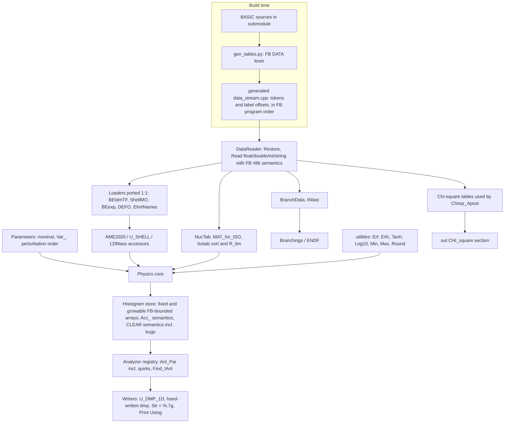

# Code map: Data layer

> Saved verbatim from the planning-session report `DataLayerScout` (agent output, 2026-10-06), source commit `ba9f0aa`. Corrections made after the report was written are listed in `README.md` in this directory; the text below is unedited.

## Summary

Static data and infrastructure slice for the C++ port of GEF v2025/1.2.

**What the slice covers.** The active data path loads 10 DATA tables plus one literal array:
- BEldmTF and ShellMO: 203×136 dense each.
- BEexp: about 3545 triplets.
- DEFO: about 8984 quadruplets.
- ElmtNames: 120 entries.
- NucPropJEFF33: 3852 rows of 8 fields, from which Isotab is derived.
- DCLbranchingJEFF33: about 4429 rows of 11 fields. Only rows up to (88,234) are loaded.
- EndA: 90 entries.
- DCLplotting: about 110 labelled evaluation tables.
- ENfrvar_lim: 304 Doubles (the literal array).

DCLplotting is used in batch. Plotting.bas runs four times (IENDFall = 0–3) on every nominal pass (GEF.bas:14715-14775), so its tables feed the `<CHI_square>` section of out/*.dat.

**Parameters.** Parameters.bas sets about 100 parameters, with about 9 redundant reassignments where the last one wins. Of these, 46 are perturbed (not 48 as the earlier report said). In batch, MyParameters.dat is never applied, and Fitpar.dat values are overwritten for each system at GEF.bas:3320.

**Analyzer framework.** About 113 Anl_Par registrations and about 100 spectrum arrays (dimensions listed in the report). 31 of them are growable through Acc_*/Extend_* accessors.

**Bugs that matter for output parity:**
- Nmulti2dpre/Nmulti2dpost are never cleared, so NmultiApre/NmultiApost in out/*.dat and NA.dmp accumulate over the whole process history.
- Several analyzer registrations are wrong:
  - NNCN's entry is overwritten twice (it ends up named NPCNtot).
  - ErotL2dlight is not found and falls back to the default Anl_Par(0) entry.
  - ErotL2dheavy maps to the wrong entry.
  - EexcL2dheavy defaults to type "analog", which prints an extra comment line in the dump.
- The d_ZISOPOST capping adds instead of assigning.
- The d_ZISOPOST reader checks the bounds of the wrong array.
- BranchData's isomer rows overwrite R_alpha of the ground-state entry, and when several isomer rows follow one entry, only the last survives.
- I_MAT_ENDF writes ctl/IMATmax.ctl from inside the event loop, so state carries over between runs.
- ZApre.dmp/ZApost.dmp rows are printed to `#f` after `Close #f`. They still land in the dump only because Freefile hands back the same file number; the reference output confirms this.

**Recommended data layer.**
- A Python converter that runs FreeBASIC's DATA lexer rules over the submodule and emits a generated C++ DATA token stream with label offsets.
- A C++ DataReader that copies fbc's rtlib behaviour: Single values via (float)strtod, "%.7g" for Str(Single), and 0 when reading past the end.
- Loaders ported line for line from BASIC, so loader quirks are kept.

**T0 test plan.** A probe-and-exit patch to a copy of GEF.bas, placed right after the tables load at line 1570. It dumps the raw DATA stream (READ into String) and every loaded table as hex bit patterns. The C++ side dumps the same format and the two are diffed exactly.

## Architecture

Porting order:
1. FB-compatible primitives: DataReader, Str/Val, float conversion and rounding.
2. Tables and loaders (T0).
3. utilities and table accessors (T1).
4. Parameters.
5. Histogram store and registry.
6. Dump writers. These can be tested byte-exact by feeding them array snapshots probed from BASIC.

## Files

### `Reference/GEF_code/source/GEF.bas`

1071-1570: the StartAgain region.
- 1076: Anl_Par ReDim.
- 1082-1219: per-nucleus Single tables with their registrations (Beta, Edefo, Zmean, Zshift, Temp, TempFF, Eshell, PEOZ, PEON, EPART, SpinRMSNZ).
- 1222-1276: BEldmTF, BEexp, DEFOtab, ShellMO, EVOD.
- 1278: Spectra.bas include; 1280-1285: DCLplotting, DCLendf, DCLbranching.
- About 1288-1310: NZPRE, NZMPRE, N_Anl.
- 1311-1345: Eva arrays; 1348-1394: initial Var_*; 1398-1444: working parameter copies; 1447-1493: Double_* arrays.
- 1553: Randomize,3; 1559-1565: table includes; 1569-1570: CElement.

Other locations:
- 723-742: Analyzer_Attributes UDT and its constructor defaults.
- 894-1012: declarations of nominal parameters (_x); 1015/1017: Parameters and ParameterManipulation includes.
- 2575-2622: final Var_* values; 3320: per-system Parameters.bas reset.
- 5112-5160: the 46 PGauss perturbation draws.
- 14715-14775: chi-square section; 14842: Close #f; 14844-15461: dmp writers.
- 15691: Find_IAnl; 15709: U_DMP_1D; 15770: U_DMP_1D_S (unused); 16217-16275: LDMass, AME2020, U_SHELL table accessors.

### `Reference/GEF_code/source/NucPropJEFF33.bas`

NucTab and Isotab.
- Lines 47-57: counting pass with no Restore (relies on the implicit restore to the first DATA in the program).
- 62-97: loader; R_SPI outside [0,1e3] is set to 0, so the -77.777 placeholders become 0.
- 99-108: MAT_for_ISO list.
- 114-128: Isoprop UDT and Isotab.
- 132-176: spin sort (For R1 = 0 To 50 Step 0.5) and R_lim formula.
- 178: includes NucProp_Functions.mac.
- 193-4046: NuclideData, 3852 rows of 8 fields (MAT, Z, A, iso, spin, parity, AWR as Double, Eexc), terminated by 9999.

### `Reference/GEF_code/source/NucProp_Functions.mac`

- I_MAT_ENDF: linear search; for unknown nuclides it does CHDIR to ctl and appends ctl/IMATmax.ctl.
- N_ISO_MAT: window of I_first..I_first+5.
- R_AWR_ENDF, ISO_for_MAT, ISO_for_ZA, NStates_for_ZA.

### `Reference/GEF_code/source/DCLbranchingJEFF33.bas`

- Lines 6-8: Z/A branching limits.
- 10-45: NZICUMU, d_NZICUMU, NZCUMU, d_NZCUMU, ZISOcumu.
- 75-106: BranchType UDT and BranchData(0..3425).
- 112-115: U_Q_beta_minus (uses AME2020); 119-142: U_Print_an (fills Qbeta); 146-167: Ibranch_for_ZAI.
- 179-4609: BranchTable; 4611: INlast; 4616-4621: EndA (90 values).

### `Reference/GEF_code/source/Branchings.bas`

Lines 1-252 are the BranchData and INlast loader, re-run on every call (Branching_first_call = 1 at line 5).
- Negative-Z rows merge into the previous record.
- R_alpha is overwritten by the isomer row (bug at line ~163).
- Unit conversion for half-lives.
- Exits at the (88,234) row.

Users of INlast are at lines 363-802.

### `Reference/GEF_code/source/BEldmTF.bas`

Dense DATA in order N = 1..203 (outer) × Z = 1..136, read into BEldmTF(N,Z) as Single. Index 0 rows and columns stay 0.

### `Reference/GEF_code/source/ShellMO.bas`

Same layout as BEldmTF: dense 203×136 DATA in ShellMO(N,Z).

### `Reference/GEF_code/source/BEexp.bas`

Fills the array with the -1.E11 sentinel, then reads (Z, A, mass excess) triplets into BEexp(A-Z, Z) until Z < 0.

About 3545 entries. Line 3587 has a stray `_,` which FreeBASIC ignores because it treats everything after a continuation `_` as a comment.

### `Reference/GEF_code/source/DEFO.bas`

Zero-fills, then reads (Z, N, beta2, beta4) into DEFOtab(N,Z) with beta4 discarded, until Z < 0. About 8984 rows.

### `Reference/GEF_code/source/ElmtNames.bas`

120 element-name strings, loaded only if CElement(1) <> "H". Used only for the ENDF ZSYMAM field.

### `Reference/GEF_code/source/DCLplotting.bas`

- Globals: IENDFall=2, Yield_threshold=0.01, Chilin and related.
- 77-130: Chisqr_Apost, which reads Afirst, Alast, Y(), dY() from the DATA stream.
- 132-171: Ploteval.
- 270-~5500: about 110 labelled evaluation tables: Apre_*, ENDF/B-VII *F/*T/*HE/*S, *JEFF311, *JEFF33, *LOHENGRIN, Modes_*, ZvsApost, nubar_*, TKEPRE/TKEPOST_*, nudel_*, Zeo_*, Z_*em_FRS2000.

### `Reference/GEF_code/source/Plotting.bas`

- 9-15: B_graphics is 0 in batch.
- 272-275: chi-square values reset.
- Selects tables by (Emode, E, Z_CN, A_CN, IENDFall) for SF, thermal, fast and 14 MeV systems.
- Run inside GEF.bas:14727/14742.

### `Reference/GEF_code/source/Spectra.bas`

All analyzer and spectrum arrays plus their registrations.
- Growable arrays have reader functions and Acc_* accumulators using Extend_1/2/3dim.
- 798-847: ENfrvar_lim literal array, 304 Doubles.
- 1733-1767: d_NZPOST with the UBound(_NZPOST,3) bug.
- 1779-1787: d_ZISOPOST reader checks the bounds of _ZISOPOST instead of its own array.

### `Reference/GEF_code/source/CLEARspectra.bas`

Per-pass zeroing, run at calcstart (GEF.bas:4816).

Bug: the Nmulti2dpre/Nmulti2dpost loops clear N2dpre/N2dpost instead. Also never cleared here: ENCNtest, plus _ENCN, _EPCN, _EgammaCN, NNCNtot and NPCNtot, which are cleared per energy step at GEF.bas:3882-3906.

### `Reference/GEF_code/source/CLEARerrors.bas`

Zeroes the error accumulators per energy step (GEF.bas:3446): _d_NZPOST, _d_ZISOPOST, d_APOST, d_ZPOST, and the d_NCN..d_TotXE scalars.

### `Reference/GEF_code/source/utilities.bi`

- Min/Max take and return Single.
- Erf = 1 - Erfc, using the Numerical Recipes Erfc evaluated in Double.
- Tanh, Coth and Log10 = Log(R)/Log(10), all user-defined.
- Also: Pyes (interactive), ShellSort1/3 (unused), CC_Count, CC_Cut, ConvTab, Extend_1dim, Extend_2dim, Extend_3dim.

### `Reference/GEF_code/source/Parameters.bas`

About 100 nominal model parameters as literal Single assignments, with redundant reassignments where the last one wins. Re-included for each system at GEF.bas:3320.

### `Reference/GEF_code/source/ReadParameters.mac`

Parser for name = value lines (strips block and line comments, uses CC_Count/CC_Cut, Val). Selects through a Case table of about 90 names. Used by MyparRead.bas and FitparRead.bas.

### `Reference/GEF_code/source/ParameterUpdate.mac`

Writes tmp/ParameterUpdate.dat, an echo of the parameters in Parameters.bas format.

### `Reference/GEF_code/source/DCLendf.bas`

- CDouble/CInteger ENDF formatters.
- HighA DATA table (82 values): unused.

### `validation/test_run/dmp/Z86_A215_n_E30MeV/ZApre.dmp`

Evidence that the rows printed with `Print #f` after `Close #f` do reach the dmp file.

## Report

# Static data and infrastructure: component decomposition for porting and testing

Conventions:
- Single = float32, Double = float64. All file paths are relative to Reference/GEF_code/source.
- "G" marks a growable array (an Acc_* accumulator that calls Extend_*).
- FB arrays are row-major: the last index varies fastest. An out-of-range last index therefore silently reads into the next row. There is no bounds checking at runtime.

## 0. Cross-cutting: DATA/READ semantics
This is the foundation of every table component. It was confirmed against the fbc master rtlib (data.c, data_readsingle.c, str_convfrom.c, str_convto_flt.c).

**How READ works:**
- DATA items form one global, program-ordered linked stream.
- `Restore label` positions the pointer at that label.
- READ advances across label boundaries without stopping.
- READ past the end yields 0, or "" for strings, and raises no error.

**How values are converted:**
- Single READ is `(float) fb_hStr2Double(text)`, where fb_hStr2Double skips spaces, handles the &H/&O/&B prefixes, maps 'd' to 'e', and then calls strtod.
- So C++ must use `(float)strtod(text)`, i.e. decimal → double → float. A direct decimal → float conversion (a `1.23f` literal) can differ.
- Double READ uses strtod directly.
- Str(Single) is `sprintf("%.7g")` with a trailing '.' removed. Str(Double) is "%.16g".

**Initial pointer.** `__fb_data_ptr` starts as NULL. NucPropJEFF33.bas:47-57 reads without a Restore and still works, so fbc must insert an implicit restore to the first DATA statement [INFERENCE: fbc's rtlDataRestore(label=NULL) and its 'afternode' parameter, plus the fact that the binary works]. NuclideData is the first DATA in the program because nothing included before GEF.bas:1052 contains DATA.

**Program DATA order:** NuclideData (included at 1052) → DCLplotting tables (1280) → HighA (1282) → BranchTable and EndA (1284) → MassData, BEexpdata, DEFOtabdata, ShellData, ElementNames (1559-1570).

**Lexer traps the converter must reproduce:**
- A standalone `_` is a continuation, and the rest of that line is ignored. Examples: BEexp.bas:3587 `-2083.5757, _,`; DCLplotting.bas:5426-5428 has lines starting with `_'`; DCLplotting.bas:5448 has `_  ' Thesis…`.
- Trailing `'` comments after Data (nubar_*).
- `/' … '/` block comments.
- Quoted strings in BranchTable and ElmtNames.
- Spaces inside items (DEFO `8 ,  8 ,`).
- `+1` and `+0` as integers; a `-0.0` literal.

## A. Table components (T0)

### A1 BEldmTF: Thomas-Fermi liquid-drop -BE
- **Source:** BEldmTF.bas:3-12 loader, DATA at 17-1424.
- **Format:** dense; 203×136 = 27,608 values expected. The converter must assert this count.
- **Contract:** `BEldmTF(0..203,0..136)` Single (GEF.bas:1222), indexed (N,Z). Loop order: I = N 1..203 outer, J = Z 1..136 inner. Row and column 0 stay 0.
- **Consumer:** LDMass (GEF.bas:16217-16237), which uses `CInt(N)` and `CInt(Z)` with round-half-even on Single values.
- **About 10 LOC of logic.**
- **Seam:** dump the whole array as hex.

### A2 ShellMO: Möller shell corrections
- **Source:** ShellMO.bas:3-11, DATA at 15-1084. Same layout as A1, 27,608 values.
- **Contract:** `ShellMO(0..203,0..136)` (GEF.bas:1255).
- **Consumer:** U_SHELL (GEF.bas:16261-16271), which scales positive values by 0.3.
- **Seam:** hex dump.

### A3 BEexp: AME2020 mass excess
- **Source:** BEexp.bas:5-34, DATA at 45-3591. About 3545 (Z, A, value) triplets, terminated by `-1,-1,-1`; only two of the three are read.
- **Contract:** `BEexp(0..203,0..136)` (GEF.bas:1233). Pre-filled with -1.E11 (stored as Single); `Read BEexp(A-Z,Z)`.
- **Consumers:**
  - AME2020 (16238-16258), which falls back to LDMass + U_SHELL + LyPair when the entry is ≤ -1e10.
  - LDMass (16224).
  - GEF.bas:3361/3368.
- **Hazards:**
  - Values carry 8-9 significant digits but are rounded to Single.
  - The converter must check N ≤ 203 and Z ≤ 136; a write beyond that would silently corrupt memory.
  - Duplicate (Z,A) keys: the last one wins.
- **Seam:** hex dump, plus AME2020 over a Z,A grid (T1).

### A4 DEFOtab: Möller ground-state β2
- **Source:** DEFO.bas:5-36, DATA at 43-9027. About 8984 (Z, N, β2, β4) rows; β4 is discarded.
- **Contract:** `DEFOtab(0..236,0..136)` (GEF.bas:1244), indexed (N,Z).
- **Consumers:**
  - GEF.bas:9313/9433, `DEFOtab(A_post - Z_sci, Z_sci)`: this mixes the scission Z with the post-neutron A, which is a physics quirk.
  - u_accel and the GDR code (16987).
- **Seam:** hex dump.

### A5 ElmtNames
- **Source:** ElmtNames.bas:1-18. 120 strings; entries 112-120 are numeric strings.
- **Contract:** `Static Shared CElement(1 To 120)` (GEF.bas:1569). Loaded once.
- **Consumer:** ENDF.bas:782 and 1025 only: `Mid(CElement(Z)+" ",1,2)`.
- **Seam:** string dump.

### A6 NucTab / Isotab: JEFF-3.3 nuclear properties
- **Source:** NucPropJEFF33.bas, about 110 LOC of logic, plus NucProp_Functions.mac, about 90 LOC.
- **Format:** 3852 rows `MAT, Z, A, iso, spin, parity, AWR, Eexc` plus the 9999 sentinel.

**Load (NucPropJEFF33.bas:47-176):**
1. The counting pass gives N_MAT_MAX = 3852.
2. `NucTab(0..N)` is a UDT (I_Z, I_A, I_ISO Integer; R_SPI Single; I_PAR Integer; R_AWR Double; R_EXC Single).
3. The MAT column (I_MAT_original) is read and discarded. The runtime MAT is the row index. The converter must assert that the column equals the row number, or ENDF MAT numbers will silently diverge.
4. I_ISO outside 0..9 triggers a print and a Sleep. R_SPI < 0 or > 1e3 is set to 0, which applies to all -77.777 "unknown" spins.
5. Each row with iso = 1 appends `I_MAT-1` to MAT_for_ISO, giving N_ISO_TOT.

**Derived Isotab(1..N_ISO_TOT):**
- N_STATES = N_ISO_MAT + 1.
- States are sorted by spin with `For R1 = 0 To 50 Step 0.5` and an exact Single equality test. Ties keep table order. Spins above 50, or not on the 0.5 grid, would drop out (none were found by grep).
- `R_lim(j) = S_j + ΔJ·(0.5 + 0.5·(ΔE/ΔJ)/(|ΔE/ΔJ| + 0.05))`.
- When spins are equal, R_lim = 1e3. That case divides by zero first (Inf/NaN) and then overwrites the result, so it must not be compiled with -ffast-math.
- The last state gets 1e3.
- R_Prob is filled later from the physics (GEF.bas:14236-14280, outside this slice).

**Functions:**
- **I_MAT_ENDF(Z,A):** linear scan from LBound = 0; the first match wins. If the nuclide is missing:
  - It prints once.
  - It does `CHDIR("ctl")`, reads ctl/IMATmax.ctl and appends a new IMAT = max + 1.
  - Hazard: if ctl/ is missing, `CHDIR("..")` moves above the working directory.
  - It is called per event for every light fragment (GEF.bas:9259), so exotic fragments write ctl state inside the event loop. The ENDF MAT of a target missing from NucTab then depends on the run history.
- **N_ISO_MAT:** scans I_first..I_first+5 and returns `I_last - I_first - 1`. If all six entries match it returns 4, not 5. It can read past UBound for rows near the end; this is not reachable with the current data.
- **ISO_for_MAT, ISO_for_ZA, NStates_for_ZA:** linear scans.

**C++ notes:** use hash maps for speed, but keep first-match semantics and the IMATmax side effect, and expose that side effect as explicit state.

**Seam:** dump NucTab(0..3852), MAT_for_ISO, N_ISO_TOT and every Isotab field as hex. T1: run all lookup functions over a (Z,A) grid.

### A7 BranchData and INlast: decay branchings
- **Source:** DCLbranchingJEFF33.bas declarations (about 110 LOC) and BranchTable 179-4609, about 4429 rows of `Z, A, iso, t, "unit", β-%, β+%, βn/βp%, β2n/β2p%, IT%, α%`. The loader is Branchings.bas:38-251, about 170 LOC.
- **Loading is re-run on every Branchings.bas pass** (line 5 forces Branching_first_call = 1). This happens on every output pass, including perturbed passes and the External cumulation.

**Loader quirks to replicate exactly:**
1. `I_Branch` advances only when `I_Work > 0`. The neutron row (Z = 0) therefore lands in BranchData(0) and goes through the isomer-row branch.
2. Negative-Z rows do not create a record. They overwrite I_Z, I_A and I_ISO of the current record and fill its _m fields. When several negative rows follow one record (e.g. -28,70 ×2; -31,61 ×3; -42,90 ×2), only the last one survives. The `_mm` branch is commented out (Branchings.bas:149-180).
3. Bug: the isomer branch sets `R_alpha = R_alpha_m * 0.01` and leaves R_alpha_m unscaled (still in percent).
4. βn and β2n go to R_beta_n/R_beta_2n if Rtot_beta > 0, otherwise to R_beta_p/R_beta_2p if Rtot_beta_plus > 0. Then `R_beta = Rtot_beta - R_beta_n - R_beta_2n` and likewise for β+. Fields not set keep their previous values; this is idempotent on reload.
5. Unit factors: ns 1e-9, ms 1e-3, s 1, min 60, h 3600, d 86400, y 3600·24·365.2422, stable 1e20. All arithmetic is Single. Any other unit prints and Sleeps.
6. The loop exits after the first (88,234) record. Rows for Z 89-111 (lines 4140-4609) are never loaded.
7. If more than 3425 positive rows were read, the write would go out of bounds; the converter must assert the count.
8. `INlast(1..90) = EndA(IZ) - IZ`, where EndA has exactly 90 values.
9. Ibranch_for_ZAI: for Z in 20..88 with no match, it returns -1 or -2 (β+ or β−) by comparing against the last A seen for that Z.

**Seam:** a probe that includes a verbatim copy of Branchings.bas:1-252 and then dumps BranchData(0..3425) and INlast as hex. T1: Ibranch_for_ZAI over a grid.

### A8 DCLplotting evaluation tables and the chi-square output
- **Source:** DCLplotting.bas:270-~5500, about 110 labels. Shapes:
  - Mass yields: `Afirst, Alast`, then Y(Afirst..Alast), then dY(...).
  - Modes_*: `first, last`, then Y, then dY.
  - nubar_, TKE*, nudel_, Zeo_: two values (value, uncertainty).
- **Batch use is real:**
  - At GEF.bas:14715 (when B_Error_Analysis = 0 and B_Fit = 0) Plotting.bas is included inside `For IENDFall = 0 To 3`, twice.
  - In batch B_graphics = 0 (Plotting.bas:9-15) because B_Print_Chisquare = 1.
  - The chi-square values are reset at Plotting.bas:272-275.
  - Tables are selected by Emode/E/Z_CN/A_CN: SF 525-757; thermal (Emode 2, E ≤ 0.05) 760-1554; fast 1557-2243; 14 MeV 2246-2501.
  - Chisqr_Apost (DCLplotting.bas:77-130) compares the APOST array with each table above Yield_threshold = 0.01.
  - ChiGEFlin uses d_APOST(0,·) only when B_Error_On = 1.
  - When N = 0 the result is 0/0 = NaN, which then fails the `Chilin > 0` test.
  - The result is the `<CHI_square>` block in out/*.dat for the covered systems (e.g. U235/Pu239/Cf252/...).
- **Fit-only bugs:** Plotting.bas:482 uses Restore Apre_Tl201 instead of the Th232p table; :816 uses Restore AM241TJEFF33 for AM242mT.
- **Hazard:** reading is stream-based, so a table whose count does not match its header bleeds into the next label. The converter must verify `2 + 2·(Alast - Afirst + 1)` per label.
- **Seam:** dump the raw stream; T1: Chisqr_Apost on a synthetic APOST.
- **Porting priority:** medium. It is needed only for parity of the out/ file. The rest of DCLplotting and Plotting.bas is graphics and should be dropped.

### A9 Literal and unused tables
- **ENfrvar_lim(0..303):** Double literal initialiser at Spectra.bas:798-847. Used for variable-bin neutron spectra at GEF.bas:8990/9103, and printed with Print Using at 14084-14087. Port it as a constexpr double array; T0 dumps it.
- **Unused:** HighA (DCLendf.bas:97-102), EVOD (declared at GEF.bas:1266, never filled or read), ENCNtest, ShellSort1/3, Coth, and U_DMP_1D_S.

## B. Parameters

### B1 Nominal parameter set
- **Source:** Parameters.bas, 122 lines, assigning about 100 globals. Declarations are at GEF.bas:894-1012, all Single.
- **Redundant reassignments where the last wins:** _P_DZ_Mean_S1 = -0.35, _P_DZ_Mean_S2 = -0.75, _P_Z_Curv_S3 = 0.072, _P_Z_Curv_SL5 = 0.01, _P_Shell_S1 = -2.3, _P_Shell_SL5 = -0.45, _P_att_pol = 1.5, _betaL0 = 22.2, _betaL1 = 0.63.
- **Not set in Parameters.bas:** _Delta_S0 = 0, EOscale = 1, Emode = 1, Emax_valid = 100 and D_Par_Fac = 1 come from their declaration initialisers; Eexc_min_multi = 3 is set elsewhere. P_Cut_S2, kappa4 and BFC stay 0. R_supp_S1..S3 are set elsewhere.
- **Categories:**
  - Mode position, curvature and shape: _P_DZ_Mean_*, _P_Z_Curv_*, P_Z_Curvmod_*, _S2leftmod, _P_A_Width_S2, Fmod_slope_S2, ZC_Mode_SL5, _PZ_S3_olap_*.
  - Shells: _P_Shell_*, P_S5_mod, Shell_fading, ETHRESHSUPPS1, ESIGSUPPS1, Level_S11.
  - Tunnelling: _T_low_*, T_low_S11, T_low_S22.
  - Polarisation: _P_att_pol*, _P_att_rel, _POLARadd, POLARfac, T_POL_RED, _HOMPOL, ZPOL1.
  - Deformation: _dE_Defo_*, _betaL/H0/1, _dbeta_S3, SIGDEFO*, DNECK.
  - Energy partition: TCOLLFRAC, _ECOLLFRAC, TFCOLL, TCOLLMIN, ESHIFTSASCI_*, _EDISSFRAC, Epot_shift, SIGENECK, EexcSIGrel, NTRANSFER*, Csort, Esort_*.
  - Even-odd: PZ/PN_EO_symm, R_EO_*.
  - Truncation: FTRUNC/ZTRUNC 50/28, ZMAX_S2.
  - Level density and spin: Tscale, Econd, Etrans = 9.5, T_orbital, _Jscaling, Spin_odd, P_n_x.
- **Hazard:** literals are Double and are converted to Single on assignment. C++ must write `float x = (float)-0.35;`, not `-0.35f`.
- **Re-application:** Parameters.bas is re-included for every system at GEF.bas:3320 when B_Fit = 0. That overwrites any Fitpar.dat values (FitparRead runs at 2555).
- **MyParameters.dat is never applied in batch.** MyparRead runs only at 1017, when B_MyParameters is still 0 (it is declared = 0 at ~1012, and the Options parser sets it later at 2866). [Strongly supported.]
- **Seam:** a probe at 1571 and another after 3320 that dump every parameter as hex.

### B2 Perturbation sigmas and draw order
- **Initial Var_* values:** GEF.bas:1348-1394, with Fred_par = 0.5.
- **Final Var_* values:** 2575-2622, multiplied by D_Par_Fac. Differences from the initial values:
  - Var_P_DZ_Mean_S5: 0 → 0.03.
  - Var_P_Shell_S3: 0.15 → 0.06.
  - Var_P_Shell_SL5: 0.03 → 0.015.
  - Var_dbeta_S3: 0.05 → 0.025.
  - Var_Jscaling: 0 → 0.03·_Jscaling.
  - Var_PZ_S3_olap_curv = 0.03·Fred·**PZ_S3_olap_curv**, the working copy. It is 0 when line 2575 runs, so the parameter is effectively unperturbed [INFERENCE].
- **Perturbed set:** 46 PGauss draws in fixed order at GEF.bas:5112-5160, from P_DZ_Mean_S1 to Jscaling. P_att_rel is copied, not drawn.
  - The order matters for the RNG stream because PGauss caches the second value of each pair.
  - Whether PGauss(mean, 0) consumes random numbers depends on its implementation (physics slice).
- **Precision:** Single = 0.06 (Double literal) × Fred × D_Par_Fac, computed in Double and narrowed to Single.
- **Seam:** dump Var_* and the 46 draws per pass to tmp/<CFileout>.par (already produced at 5166-5281).

### B3 Parameter-file I/O
- ReadParameters.mac (about 200 LOC): strips `/'…'/` and `'` comments, requires exactly one '=' (CC_Count = 2), upper-cases the name, uses Val into Single, and matches a Case list of about 90 names. Unknown names print `<E>`. It also prints every line to the console.
- Hazard: an unterminated `/'` makes the comment-stripping loop spin forever.
- FitparRead.bas reads Fitpar.dat if it exists, at 1017 and 2555.
- ParameterUpdate.mac writes tmp/ParameterUpdate.dat with FB Print formatting.
- Porting priority: low (fit mode and side files). Keep the Fitpar.dat override path for the coverage matrix.

## C. Infrastructure

### C1 utilities.bi math (about 60 LOC; T1)
- **Min/Max(Single,Single) → Single:** Integer arguments go through Single. This is exact for integers below 2^24, as in the Extend_* bounds.
- **Erf = 1 - Erfc:** Erfc follows Numerical Recipes, computed in Double (`t = 1/(1+0.5z)`, Horner polynomial, `exp`) and returned as Single. Do not use std::erf.
- **Tanh/Coth:** `exp(-2x)` in Double, result stored in Single.
- **Log10 = Log(R)/Log(10):** computed in Double, stored in Single. It feeds `Round` (GEF.bas:18074) through `Int(Log10(...))`; floor-edge cases such as values near powers of 10 change output digits.
- **Users:** Gaussintegral (17814) for Erf; σpol at 6491-6555 and spin at 7444/7482 for Tanh.
- Pyes, CC_Count, CC_Cut and ConvTab handle parsing and interactive input only.
- **Seam:** a standalone FB driver that includes utilities.bi and dumps grids as hex, including ±0, large values, denormals and NaN.

### C2 Growable arrays: Extend_* and Acc_* accessors (about 50 + about 400 LOC)
- **Extend_Ndim** (utilities.bi:~263-372): computes the union of the old and new bounds (via Single Min/Max), copies to a work array, ReDims, zeroes and copies back. The Lbound can move downward.
- **Pattern** (Spectra.bas:54-80 and repeated): `Function X(i,j)` returns 0 outside the bounds; `Sub Acc_X(i,j,v)` extends the array and then adds.
- **Growable arrays (31):**
  - _NZPOST, _ZISOPRE, _ZISOPOST, _Edefo2d, _JFRAGpre, _JFRAGpost, _Eintr2d, _Ecoll2d, _EexcA2d.
  - _EPCN, _ENCN, _ENsci, _ENfr, _ENfrfs, _ENfrC, _ENApre2dfs, _ENApost2dfs.
  - _AEkinpre, _AEkinpost, _ATKEpre, _ATKEpost, _AQpre.
  - _EGammaCN, _EGamma, _EGammaL, _EGammaH, _EGammaE2, _EGammatot, _Eentrance.
  - _d_NZPOST, _d_ZISOPOST.
- **Hazards:**
  - Acc_ index parameters are Integer, so a Single argument is rounded half-to-even at the call (e.g. Acc_AQpre(…, Qvalue_sci) at 8724; Acc_Edefo2d(…, CInt(10·Edef1))). Callers also mix in `Int()` (floor), as in Acc_ENfr(Int(E·1000)).
  - The final bounds feed the dmp extent heuristics, so the C++ store must model FB bounds (an offset-indexed N-d array with a resizable lbound/ubound), not std::map.
  - Acc_d_NZPOST (Spectra.bas:1759) tests `UBound(_NZPOST,3)` on a 2-D array. That returns -1, so it extends on every call. Values are unchanged; only cost is affected.
  - The d_ZISOPOST reader (1779-1787) checks the bounds of _ZISOPOST. Once the two arrays have grown differently, it reads out of bounds or returns 0 for valid cells.
  - At GEF.bas:11383-11392, stage 0 of d_ZISOPOST is *accumulated*. The cap "if σ > y or σ = 0 then σ = y" therefore stores σ + y. In contrast, d_NZPOST assigns directly at 11408 (`_d_NZPost(0,I,J) = …`, with I = N-Z).
- **Seam:** a driver that includes utilities.bi plus Spectra.bas with stubs, feeds an Acc_ call sequence, and dumps bounds and contents. Alternatively, a probe before the dmp section (14844) that dumps every array's bounds and hex contents.

### C3 Analyzer registry and Find_IAnl
- **UDT** (GEF.bas:723-742): C_Name/C_Title/C_xaxis/C_yaxis/C_Linesymbol as String*128, C_Type as String*20, R_ALim(1..4,1..3) Single, I_Dim.
- **Constructor defaults:** binsize 1, first bin 0, I_Dim = 1, xaxis "Channel", yaxis "Counts", linesymbol "HT0", type "analog".
- `Anl_Par(0..1000)` is ReDimmed at 1076. There are about 113 registrations, in this order: GEF.bas 1082-1276 (16), Spectra.bas (~94), DCLbranching ZISOCUMU, NZPRE, NZMPRE. Then `N_Anl = I_Anl`.
- **Find_IAnl** (15691-15707): strips any "(...)" suffix, compares with Trim(UCase(...)), returns the first match, and returns 0 (the defaults entry) when nothing matches.
- **Registry quirks that change dmp text:**
  - NNCNtot and NPCNtot (Spectra.bas:1082-1096) do not increment I_Anl, so NNCN's entry ends up named "NPCNtot".
  - The array ErotL2dlight is registered as "ErotL2dheavy", and ErotL2dheavy as "ErotL2d". So the dump call "ErotL2dlight(i)" falls back to Anl_Par(0) (empty title, Channel/Counts, HT0, analog), and "ErotL2dheavy(i)" picks up the light registration.
  - _EexcA2d is registered as "Eexc2dlight".
  - EexcL2dheavy has no C_Type, so it defaults to "analog" and U_DMP_1D prints the extra `C: Y_{i}(X_{i}) contains the integral…` line.
  - The DEFOtab registration is named "be^g$s$ (Moeller)".
  - Binsizes that matter: R_ALim(1,3) = 0.001 for EPCN/ENCN/ENsci/ENfr/ENfrfs/ENfrC/Qbeta; 0.1 for Emultichance.
- **C++:** generate the registry as data, or port it 1:1 including the quirks. T0: compare against a probe dump of Anl_Par(0..N_Anl) at ~1310.

### C4 Spectrum and analyzer array inventory
Double unless marked S (Single). "(n)" means 0..n.

**GEF.bas StartAgain (per-nucleus deterministic tables, filled by the physics; T1 probe targets):**
- Beta(-1..7,1..2,150) S.
- Edefo(-1..5,1..2,150) S.
- Zmean, Zshift, Temp, TempFF, Eshell: each (0..5,1..2,350) S.
- PEOZ, PEON, EPART: each (0..7,1..2,350) S.
- SpinRMSNZ(0..7,1..2,1..200,1..150) S.
- NZPRE(200,150) S; NZMPRE(0..7,200,150) S.
- Eva I/O vectors at 1311-1345.

**Spectra.bas, nuclide and mass distributions:**
- EMpot(7,150) S; Emultichance(1000), a scratch buffer filled from E_multi_chance at dump time.
- ZPROV(150), ZMPROV(0..7,150); _NZPOST(0..50 [N-Z], 20..70 [Z]) G.
- ZPOST(150), ZMPOST(0..7,150); NPRE/NPOST(200); NMPRE/NMPOST(0..7,200).
- APOST, APROV, APRE(350); AMPOST, AMPROV, AMPRE(0..7,350).
- _ZISOPRE, _ZISOPOST(50..160,20..80) G.
- SigmaZpre, SigmaZpost, Zpolarpre, Zpolarmac, Zpolarpost(350).

**Spectra.bas, energies and spins:**
- _Edefo2d(50..200,100) G; EdefoA(350).
- _JFRAGpre, _JFRAGpost(0..50,20..70,0..20) G.
- _Eintr2d and _Ecoll2d(80..160,50) G; EintrA, EcollA(350).
- _EexcA2d(80..160,100) G.
- EexcL2dlight, EexcL2dheavy(1000,50); ErotL2dlight, ErotL2dheavy(500,50).

**Spectra.bas, neutron multiplicities and spectra:**
- Nmulti2dpre, Nmulti2dpost(350,20): **never cleared**. N2dpre, N2dpost(350,20).
- NmultiApre/post, NApre/post(350): derived at GEF.bas:10086-10111.
- _EPCN, _ENCN, _ENsci, _ENfr, _ENfrfs(1000) G; ENCNtest(1000), unused; ENfrvar(303); _ENfrC(5,5,1000) G.
- ENlight, ENheavy(100000); ENM(0..7,100000).
- ENApre2d, ENApost2d(350,1000), with no bounds check; ENApre/post(350).
- _ENApre2dfs, _ENApost2dfs(200,50) G; ENAprefs/ENApostfs(350).
- NP, NN, NNCN, NNCNtot, NPCNtot, NNsci, NNfr, NNlight, NNheavy(50); Ndirlight(-100..100).
- nuTKEpre/post(250,20); DPLOCAL(150); DNLOCAL(200).

**Spectra.bas, kinetic energies and Q values:**
- _AEkinpre, _AEkinpost(50..200,80..100) G; EkinApre, EkinApost(350); Ekinpre, Ekinpost(300); EkinpreM/postM(0..7,300).
- _ATKEpre, _ATKEpost(50..200,200..200) G; TKEpre, TKEpost(300); TKEpreM/postM(0..7,300); TKEApre/post(350); TotXE, Qvalues(300).
- _AQpre(200,200..200) G; QA(350).

**Spectra.bas, gammas and decay:**
- _EGammaCN, _EGamma, _EGammaL, _EGammaH, _EGammatot, _Eentrance(1000) G; _EGammaE2(5000) G.
- NGammatot(100); NgammaA(350,100); Qbeta(20000) (1 keV bins, filled by U_Print_an).
- EgammaA2/10/100/1000 only under the B_EgammaA flag, which is off.

**Spectra.bas, error accumulators:**
- _d_NZPOST(0..2,0..50,20..70) G; _d_ZISOPOST(0..2,50..160,20..80) G; d_APOST(2,350); d_ZPOST(2,150).
- Scalars d_NCN, d_Nsci, d_Nfr, d_Nlight, d_Nheavy, d_Ntot, d_ENfr, d_Ng, d_Eg, d_Egtot, d_Q, d_TKEpre, d_sigma_TKEpre, d_TKEpost, d_sigma_TKEpost, d_TotXE, each (2).

**DCLbranching:** NZICUMU(250,120,3) S; d_NZICUMU(2,250,120,3); NZCUMU(250,120) S; d_NZCUMU(2,250,120); ZISOcumu(350,150); d_R_nu_delayed(2); C_out_an() strings.

**What fills them:** the event loop at GEF.bas 7922-9997 (see the Acc_ call list: 8300-9494, 16800 in Eva), post-loop derivations at 10080+, Branchings.bas, and the External cumulation (14818).

### C5 Clearing semantics
- **CLEARspectra** (at calcstart, GEF.bas:4816) runs on every pass. It zeroes everything above except:
  - Nmulti2dpre and Nmulti2dpost: the bug clears N2dpre/N2dpost twice instead. Their counts therefore accumulate over every pass and every energy step in the process. NmultiApre/post is the ratio of accumulated counts, so it is biased toward earlier steps. This is visible in out/*.dat (13545-13563) and NA.dmp. It is only non-zero once multi-chance fission occurs.
  - ENCNtest.
  - _ENCN, _EPCN, _EgammaCN, NNCNtot, NPCNtot: cleared only per energy step (3882-3906), because the pre-pass runs once per step.
- CLEARspectra also sets B_nopot = -1.
- **CLEARerrors** runs per energy step (3446).
- **C++:** model "clear sets" explicitly per scope (pass, energy step, process) and encode the bug as a named fidelity quirk that can be toggled off later.

### C6 Dump writers
**U_DMP_1D** (GEF.bas:15709-15768), about 60 LOC.
- `Imax`: the last non-zero entry scanning down from UBound, defaulting to `Min(L+10, U)`. Then `if Imax > 0.8·U then Imax = U`.
- `Imin`: the first non-zero entry, defaulting to `Max(L, U-10)`. Then `if Imin < L + 0.1·(U-L) then Imin = 0`. This is a literal 0 and is only a latent out-of-bounds hazard when L > 0.
- If Imin > Imax, both are reset to (L, L+1).
- **Header:** `C: Written on dd.mm.yyyy, hh:mm:ss` (a timestamp; mask it in tests), `C: Calculation performed with GEF<ver>`, `S: ANALYZER(name)`, `S: TITLE(...)`, two `S: COMMENT(...)` lines, the optional analog C: line, `X:`, `Y:`, then `A: (X = Str(Imin·bin) TO Str(Imax·bin) BY Str(bin)) Y,<linesym>`.
- Here `Integer × Single` is a Single, printed with "%.7g".
- **Values:** `Trim(Str(CSng(a(i))))`, comma separated, with no comma after element UBound. A line is flushed once it reaches 128 characters or more; then a final line and " ".
- **Hand-written dumps:** ZApre/ZApost (15019-15157) use `Print #f, Using "####    ###.######"` after `Close #f` (14842). This works only because `DMPFile = Freefile` reuses f's number; validation/test_run/dmp/*/ZApre.dmp contains the rows. C++ should write the rows to the dmp file and document the reason.
- U_DMP_1D_S is unused.
- **Seam:** a probe at 14844 that dumps each array's bounds and hex contents, plus Anl_Par. A C++ writer fed the same snapshot must reproduce every *.dmp byte for byte except the timestamp line. This isolates formatting from physics and can be done early.

## D. Recommended C++ data layer and T0 harness

**1. Converter** (`tools/gen_gef_data.py`, run by CMake from the submodule; outputs regenerated and optionally committed):
- Implement FB's DATA lexing: continuation `_` with the rest of the line ignored, `'` and `/' '/` comments, labels `name:`, quoted strings, whitespace trimming.
- Respect program DATA order, following the include order listed in section 0. Only the active files are used (NucPropJEFF33, DCLplotting, DCLendf, DCLbranchingJEFF33, BEldmTF, BEexp, DEFO, ShellMO, ElmtNames).
- Emit `data_stream.cpp`: `const char* const kTokens[]` (normalised literal text), `kIsString[]`, and `{label, offset}`.
- Emit ENfrvar_lim and Parameters.bas as generated constexpr Double literals plus assignment code. Keep Double literals and narrow at runtime.
- Assertions:
  - Dense counts are 27,608.
  - NucTab MAT column equals the row index.
  - BEexp and DEFO indices are in range.
  - BranchTable has at most 3425 positive rows up to (88,234).
  - EndA has 90 values.
  - Plotting tables satisfy `2 + 2·(last - first + 1)`.
  - Report duplicate keys.

**2. C++ DataReader** emulating the rtlib:
- `restore(label)`; `read_single() = (float)strtod`; `read_double() = strtod`; integer reads per fb_hStr2Int/Longint semantics; strings.
- Past the end: 0 or "".
- Cross-label reads are allowed.
- Startup parsing of about 150k tokens takes milliseconds.
- Embed the data (no runtime data files), which removes path and cwd hazards.

**3. Loaders:** port them 1:1 from BASIC (section A), on FB-bounded array types (offset base, row-major), including every quirk. Optimised lookups such as a (Z,A)→MAT hash are added only behind tests proving equivalence with the linear-scan first-match result.

**4. T0 reference (BASIC side)** as a versioned patch to a copy of GEF.bas: insert `#ifdef GEF_PROBE_T0` after line 1570. All tables are loaded at that point, in the true compile context and include order.
- **(a) Raw stream:** `Restore NuclideData`, then `Read s As String` for the converter's total count + 5. Numeric items return the compiler-stored literal text. This settles whether fbc normalises literals, as well as the `_,` and `_'` lexing cases.
- **(b) Post-load state:** every element of BEldmTF, BEexp, DEFOtab, ShellMO, NucTab, MAT_for_ISO, Isotab, CElement, ENfrvar_lim, Anl_Par(0..N_Anl), and all parameters and Var_*. Each line is `name idx… hex(bits) Str(v)`, using `Hex(*Cast(ULong Ptr,@x),8)` for Single and the 16-digit form for Double.
- **(c) BranchData/INlast:** `#include` a harness copy of Branchings.bas:1-252 (taken by line range from the submodule), dump, then `End`.
- A second probe after GEF.bas:2623 captures the final Var_*.
- **C++ side:** a `gef_dump_tables` tool writes the identical format, and an exact textual diff is the T0 acceptance check.

**5. T1 extensions on the same harness:**
- Utility functions (utilities.bi driver).
- Table accessors: AME2020, LDMass, U_SHELL, U_SHELL_exp, I_MAT_ENDF in a fresh ctl/, N_ISO_MAT, ISO_for_ZA, Ibranch_for_ZAI, U_Q_beta_minus, over full Z,A grids. The calls must not run in the event loop, because I_MAT_ENDF writes ctl/IMATmax.ctl.
- Chisqr_Apost on synthetic APOST.

**Suggested milestones for this slice:**
- **M0:** converter, DataReader, loaders and BASIC probe → T0 green, covering the raw stream and post-load state.
- **M1:** utilities, Round/Log10 and Str/Print Using emulation → T1.
- **M2:** parameters and Var_ → T0/T1, including the reset at 3320.
- **M3:** FB-bounded array store, Acc_/Extend_, registry and clear sets → T2 via an Acc_ sequence driver.
- **M4:** U_DMP_1D and hand-written dmp writers replayed from BASIC snapshots → byte-exact, timestamp masked.
- **M5:** chi-square block parity.

## E. Suspicious or unclear items
1. Nmulti2dpre/post are never cleared (CLEARspectra bug); this affects out/ and NA.dmp.
2. BranchData: isomer rows overwrite R_alpha (R_alpha_m stays in percent); multiple isomer rows collapse to the last; rows for Z > 88 are never loaded; the neutron row goes to index 0.
3. Registry: NNCN's entry is overwritten; the ErotL2d names are swapped or missing; EexcL2dheavy is "analog".
4. d_ZISOPOST: the reader checks the wrong bounds, and the stage-0 cap adds instead of assigning.
5. Acc_d_NZPOST checks UBound(_NZPOST,3), so it extends on every call.
6. MyParameters is a no-op in batch; Fitpar.dat values are reset for every system.
7. Var_PZ_S3_olap_curv uses the working copy, which is probably 0 [INFERENCE].
8. The earlier report's count of 48 perturbed parameters is wrong; it is 46.
9. I_MAT_ENDF performs filesystem I/O and CHDIR inside the event loop, so state persists across runs through ctl/IMATmax.ctl.
10. ZApre/ZApost rows print to `#f` after it is closed; this works through Freefile reuse.
11. The counting pass in NucPropJEFF33 depends on the implicit first-DATA restore and on include order [INFERENCE].
12. U_DMP_1D forces Imin = 0 regardless of LBound (latent out-of-bounds read).
13. The Isotab R_lim computation passes through a division by zero (NaN) before being overwritten; do not use -ffast-math.
14. N_ISO_MAT returns 4 when six consecutive rows match.
15. DEFOtab is indexed with A_post - Z_sci at GEF.bas:9313/9433.
16. Fit-only Restore label mistakes at Plotting.bas:482 and :816.
