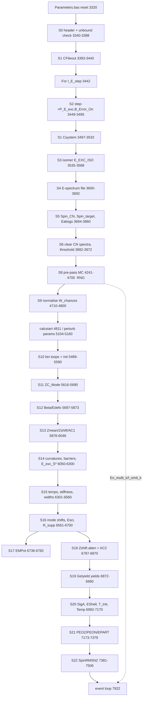

# Code map: Setup physics

> Saved verbatim from the planning-session report `SetupPhysicsScout` (agent output, 2026-10-06), source commit `ba9f0aa`. Corrections made after the report was written are listed in `README.md` in this directory; the text below is unedited.

## Summary

The setup slice of GEF.bas runs from line 3287 to 7919, plus the physics functions at 15814-18051. It breaks down into 22 live components (S0-S22) plus one dead block (S23).

**Per system and energy step (run once per step):**
- naming
- energy-step mapping
- isomer and target spin
- E-spectrum reader
- CN kinematics (Eabsgs, Spin_CN)
- the stochastic multi-chance pre-pass. It runs once per energy step, and every perturbed and nominal calcstart pass reuses its result.

**Per Energy_loop bin (I_E_Distr, I_N_Multi, I_Z_Multi, I_E_Multi):** a deterministic table builder (5489-7516) runs again for every bin with NEVTused>0, and on every calcstart pass, because it reads perturbed parameters. Its outputs:
- Beta/Edefo
- Zmean/Zshift
- AC/NC/ZC
- barriers and E* per mode
- widths
- mode yields
- Temp/TempFF
- PEOZ/PEON
- EPART
- SpinRMSNZ

**Correction to PhysicsCoreScout:** the GEFSUB/GEFRESULTS block at 7514-7919 is not live. It sits inside a nested /' ... '/ comment (opened at 7514, closed at 7919). Supporting evidence: run.log never prints its 'N_cases' line. NZMPRE, NZPRE, Etab, Jtab and Ytab are never filled. U_Gauss_mod, U_Even_Odd, U_LinGauss and U_Box2 are used only there.

**Key hidden-state hazards a faithful port must reproduce:**
- The pre-pass even-even GN suppression tests the stale global Single `Z`, not Z_left. `Z` is last written by the Mode-5 Z(A) loop of the previous bin, and is 0 at process start. So the first energy step of a process behaves differently from later steps, notably for odd-Z CN.
- E_tunn, E_pot_scission and E_diss_Scission are overwritten inside the EPART mode loop. The event loop then reads the I_Mode=7 values.
- Beta(4,1,*) is never written, so it stays 0. The Mode-4 loop writes into Beta(5,1,*) by mistake, and that write is overwritten later.
- EPART, PEOZ and PEON outside A in [40, A_CN-40] are never cleared, yet SpinRMSNZ reads them.
- Beta_Equi is a continuation minimiser with ByRef carry-over.

**Zero-patch seams already exist:**
- the out/*.dat `<Control>` block (about 60 table scalars, GEF.bas:14600-14660)
- `<Multi_chance>`
- Multichance.dmp, EMpot.dmp, XE.dmp/Epart
- the run.log barrier and chance printouts

Bit-exact work needs probe patches that dump hex floats at three points: after line 3860, after line 4800, and at 7920 for each bin.

## Architecture

Nesting: For I_Double_Covar (3294) > Parameters.bas reset > For I_E_step (3442) > [S2 step map, S1 naming, S3 isomer, S4 spectrum, S3/S5 spin+Eabsgs] > S6-S9 multi-chance pre-pass (RNG; once per step) > calcstart (4811; perturbed/nominal passes) > parameter perturbation (5104-5160) > For I_E_Distr > For I_N_Multi > For I_Z_Multi > For I_E_Multi (Energy_loop 5533) > S10 bin init > if NEVTused>0: S11-S22 deterministic table builder > event loop (7922).

Data flow: pre-pass -> E_multi_chance, Inofirst, Imulti, En_multi_k, I_emit_k, NNCNtot, NPCNtot, _EnCN, _EpCN, _EgammaCN -> bin loop weights -> per-bin tables -> event loop.

The table builder is pure apart from these inputs:
- per-bin inputs (I_Z_CN, I_A_CN, R_E_exc_used, Spin_CN, E_rot_CN)
- the parameter set in effect
- Delta_S0
- persistent arrays: EPART/PEOZ/PEON edges, Beta(4,1,*)=0

It writes many globals that the event loop reads, including the mode-7 leftovers E_tunn and E_diss_Scission.

## Files

### `Reference/GEF_code/source/GEF.bas:3287-3440`

Per-system header: Parameters.bas reset (3320), local-parameter stub, barrier/mass printout (BFTF/BFTFA/BFTFB/AME2020/LyMass/U_SHELL*), unbound-CN skip (Sn<0 -> Goto Next_Iline_label, 3378-3388), CFileout naming (3393-3440)

### `Reference/GEF_code/source/GEF.bas:3442-3533`

Energy-step loop head: CLEARerrors, P_E_exc/B_Error_On per step incl. ENDF N+3 schedule (3459-3495), Csystem naming with Str(Single) (3497-3533)

### `Reference/GEF_code/source/GEF.bas:3535-3588`

Isomer lookup: target ZT/AT by Emode, I_MAT_ENDF/N_ISO_MAT, E_EXC_ISO added to P_E_exc

### `Reference/GEF_code/source/GEF.bas:3600-3692`

E* spectrum file reader for ES/EM (2 or 3 columns), E_spectrum/L_spectrum/W_spectrum, normalization (runs for every Emode), NE_all/NE_fis

### `Reference/GEF_code/source/GEF.bas:3694-3860`

Spin_CN for SF/GS/EB, target spin from NucTab, Eabsgs + Spin_CN kinematics for n/p/alpha (Select Case Emode 3786-3843), range warnings

### `Reference/GEF_code/source/GEF.bas:3882-4800`

Multi-chance pre-pass: clears CN spectra (3890-3907), threshold Eexc_min_multi (3950-3967), interactive-only Pfistest output (4064-4180), MC loop (4241-4700) with widths GN/GP/GF/Ggamma, pre-equilibrium PPower_Griffin_v, Maxwell emission, E_multi_chance/En_multi_k/I_emit_k packing, NNCNtot/NPCNtot, W_chances normalization (4766-4800)

### `Reference/GEF_code/source/Pfistest.mac`

Width formulas for the interactive Pf(E) table only (Bfilein=0). It is NOT identical to the inline pre-pass block. Differences: dEf shift in Ftunn, Red_diss offset -20 vs -10, BFA/BFB use Z_left vs P_Z_CN, ypsilon formula, af_an argument. Do not use it as the pre-pass reference.

### `Reference/GEF_code/source/GEF.bas:5489-5590`

E-distribution/multi-chance bin loops (5522-5533 Energy_loop), per-bin I_A_CN/I_Z_CN/R_E_exc_used/R_NEVTspectrum/Spin_CN, I_eff_CN, E_rot_CN, NEVTused=CLngInt

### `Reference/GEF_code/source/GEF.bas:5591-6046`

Escission_lim, mode centres ZC_Mode_0..5 (5616-5690), scission deformations Beta/Edefo modes -1..7 incl. Beta_Equi (5697-5873), Z(A) polarisation Zmean/Zshift (5876-5986), AC/NC 1st iteration (5990-6046)

### `Reference/GEF_code/source/GEF.bas:6050-6700`

Curvatures (Masscurv*), barriers B_F/E_A/E_B, shell effects and B_S*, E_exc_S*, E_Min_Barr, T_Coll/T_Pol/T_Asym, E_pot_scission, polarisation stiffness (LyMass/ECOUL), SigZ/SigPol/R_Att, energy-dependent mode shifts DZ_S*, EsciS*, R_supp/R_slope_S2

### `Reference/GEF_code/source/GEF.bas:6736-7170`

EMPot (first-chance bin only), Zshift attenuation by R_Att, AC/NC 2nd iteration, Getyield mode yields + normalisation + P_selected, SigA widths, EShell, T_intr, Temp/TempFF

### `Reference/GEF_code/source/GEF.bas:7173-7506`

Even-odd PEOZ/PEON and energy sorting EPART per mode (7182-7379), E_coll_saddle, EINTR_SCISSION, side-effect overwrite of E_tunn/E_pot_scission/E_diss_Scission; RMS spins SpinRMSNZ (7381-7506)

### `Reference/GEF_code/source/GEF.bas:7514-7919`

DEAD: GEFSUB/GEFRESULTS folding block (NZMPRE, NZPRE, NZMkey, Etab, Jtab, Ytab), inside nested comment /' (7514) ... '/ (7919). Racc at 7920 is the first live line before the event loop.

### `Reference/GEF_code/source/GEF.bas:15814-18051`

Physics/utility functions: masses, shells, barriers, level densities, temperatures, Getyield, Masscurv*, Z_equi, Beta_Equi, GDR, even-odd, samplers (classified in report)

### `Reference/GEF_code/source/utilities.bi:17-73`

Single-typed Min/Max, custom Erf = 1-Erfc (Numerical Recipes erfc in Double), custom Tanh. These are required for bit-exactness.

### `Reference/GEF_code/source/NucProp_Functions.mac:11-64`

I_MAT_ENDF returns a NucTab index. For missing nuclides it assigns a new index and appends it to ctl/IMATmax.ctl, a persistent file side effect.

### `Reference/GEF_code/source/GEF.bas:14600-14660`

out/*.dat <Control> block: prints about 60 setup scalars (E_exc_S*, B_S*, Yield_Mode_*, AC/NC_Mode_*, SigZ, P_Pol_Curv_S0, E_POT_Scission, EINTR_SCISSION). Zero-patch T1-level seam at 7 significant digits.

### `Reference/GEF_code/source/GEF.bas:14884-14915,15452-15461`

EMpot.dmp, Multichance.dmp (W_chances + E_multi_chance arrays) and Epart dump in XE.dmp: existing intermediate-table outputs

### `Reference/GEF_code/source/GEF.bas:12075-12300`

out/*.dat Non-fission results (NNCNtot/NPCNtot renormalised again), P_f = Imulti/N_multi_sample, Pf per E channel (EM), <Multi_chance> W_chances and E_multi_chance tables

### `Reference/GEF_code/source/Parameters.bas`

Nominal parameter values used by the setup. Underscore names are perturbed per pass (GEF.bas:5104-5160). Tscale, Econd, Etrans, kappa, TCOLLFRAC, ESHIFTSASCI_*, PZ_EO_symm etc. are never perturbed. Last assignment wins (duplicates).

## Report

# Setup slice: per-system / per-energy deterministic setup (GEF.bas 3287-7919 + functions 15814-18051)

Line numbers were verified by reading. LOC means logic lines, excluding comments and prints. [INFERENCE] marks claims not observed directly.

## 0. Ordering / dependency graph

### Re-execution frequency

| Components | How often |
|---|---|
| S0, S1a | once per system (I_Double_Covar) |
| S1b-S9 | once per energy step |
| S10-S22 | once per calcstart pass (I_Error = 0..N_Error_Max) × per bin with NEVTused>0 |

S10-S22 read perturbed parameters (P_Shell_S*, P_Z_Curv_*, dE_Defo_*, betaL*/H*, T_low_*, EDISSFRAC, ECOLLFRAC, HOMPOL, POLARadd, Jscaling, Delta_S0, …).

S8 depends only on non-perturbed globals (Tscale, Econd, Etrans) and nominal inputs. It is not re-run per pass (comment at 3884-3889), so all 31+1 passes share one pre-pass realisation.

**Number of bins:**
- Non-multi-chance runs: a single bin.
- When Inofirst>0 or Emode=13: up to 11×11×1001 bins, each with E*=0.1·I_E_Multi.
- Emode=3: Ubound(E_spectrum) bins.

**Multi-chance cost:** S12 (Beta_Equi) and S22 are recomputed for every populated bin. This is the dominant setup cost; the cache key is (I_Z_CN, I_A_CN, R_E_exc_used, params).

## 1. Components

### S0 System header and validity check (3287-3388)

- **Size:** ~25 LOC of logic.
- **Inputs:** P_Z_CN, P_A_CN (or the _Double variants for I_Double_Covar=2, 3301-3305); B_Fit; Clocal.
- **Logic:**
  - Re-includes Parameters.bas when B_Fit=0. This resets every nominal `_x`.
  - The local-parameters branch only prints 'not available'.
  - Prints BFTF(..,0), BFTFA/BFTFB(..,1), estimated third saddle BFC, AME2020, LyMass, U_SHELL, U_SHELL_exp, Sn.
  - If AME2020(Z,A-1)-AME2020(Z,A)<0 → Goto Next_Iline_label, skipping the whole system.
- **Writes:** BFC (global, print only).
- **Hazards:** Round(…,3) is the custom Round at 18064, used for printing only.
- **Seam:** zero-patch. run.log lines 26-33 of the test run show the printed values. Unformatted Print gives Single at 7 significant digits.

### S1 Output naming (3393-3440, 3497-3533)

- **Size:** ~60 LOC.
- **Inputs:** P_Z_CN, P_A_CN, I_E_iso, Emode, P_E_exc, I_Mode_selected, B_Double_Covar.
- **Writes:** CFileout, CFileout_full, Csystem, CFileoutlmd_full.
- **Hazards:**
  - Csystem embeds Trim(Str(P_E_exc)), i.e. FB Single formatting such as '2.53e-08' and '19.5'.
  - It uses P_E_exc before the isomer energy is added in S3.
- **Seam:** a pure string function. Compare names against existing dmp/out names.

### S2 Energy-step mapping (3449-3495)

- **Size:** ~40 LOC.
- **Inputs:** Emode, B_ENDF, N_E_steps, B_Random_on, Energy_table, Spin_Table, En_min, En_max.
- **Writes:** P_E_exc, P_I_rms_CN, B_Error_On.
- **Suspicious:** the N_E_Steps=2 non-random branch uses `Energy_table(I)` with the stale global LongInt I (3477). [INFERENCE] It is unreachable, because N_E_steps is 1, 2 (random only) or N+3 ≥ 5.
- **Seam:** pure function (step → (E, B_Error_On)). Unit test only.

### S3 Isomer and target-spin lookup (3535-3588, 3702-3784)

- **Size:** ~90 LOC.
- **Inputs:** NucTab (T0 data), I_MAT_ENDF, N_ISO_MAT, I_E_iso, Emode, P_E_exc, P_I_rms_CN.
- **Writes:** E_EXC_ISO and E_EXC_TRUE (module Statics), P_E_exc (+E_EXC_ISO), Spin_CN (SF/GS with E=0: NucTab R_SPI; else P_I_rms_CN; EB: P_I_rms_CN), Spin_target (EN/EP/EA).
- **Hazards:**
  - I_MAT_ENDF returns a NucTab index, not a MAT number. For nuclides missing from NucTab it fabricates an index > UBound and appends it to ctl/IMATmax.ctl (NucProp_Functions.mac:28-49). This is a persistent state and file side effect, so the bounds checks route such nuclides to spin 0.
  - Isomers are assumed to sit at NucTab(I_MAT+I_E_iso).
  - A missing isomer → Goto RepeatInput (3557), i.e. an interactive loop.
- **Seam:** pure given NucTab. Use a driver or a probe that prints Spin_CN and Spin_target. run.log prints 'Ground-state spin … imposed'.

### S4 E* spectrum reader (3600-3692; ES/EM only)

- **Size:** ~70 LOC.
- **Logic:**
  - Skips leading `'` comment lines.
  - The column count comes from CC_Count on the first data line (2 → E,W; 3 → E,L,W).
  - Reads with Input # until EOF.
- **Writes:** E_spectrum, L_spectrum, W_spectrum (ReDim Preserve, persisting across systems); Ichannel (a **Single** global, 2676); W_spectrum normalised; W_spectrum_max; NE_all/NE_fis(Ichannel); I_Warning when REmax>11.
- **Hazards:**
  - The normalisation loops (3680-3689) run for every Emode. With the default W_spectrum(1)=0 this computes 0/0 = NaN. That is harmless because nothing reads it.
  - A missing file → Sleep, End.
- **Seam:** pure parser. Compare arrays.

### S5 CN excitation and spin kinematics (3786-3860)

- **Size:** ~45 LOC.
- **Inputs:** Emode, P_E_exc, P_Z_CN, P_A_CN, Spin_target, AME2020, BFTFB.
- **Formulas by Emode:**
  - Emode 0: Eabsgs = P_E_exc + BFTFB(Z,A,1).
  - Emode ±1: Eabsgs = P_E_exc.
  - Emode 2: Eabsgs = En·(A-1)/A + M(Z,A-1) - M(Z,A); Spin_CN = sqrt(St² + 0.25 + (0.1699·(A-1)^0.333333·sqrt(En))²).
  - Emode 12: as 2, with a Coulomb factor using Bprot (global).
  - Emode 22: −28.295 Q-shift; Balpha (global).
  - Emode 3/13: nothing. Eabsgs keeps its stale value; Emode 13 sets it per sampled history.
- **Writes:** Eabsgs, Spin_CN, Bprot, Balpha.
- **Hazards:**
  - `(P_A_CN-1)/P_A_CN` is Integer/Integer, which FB evaluates as floating division.
  - `^` returns Double.
  - Eabsgs<0 → End.
- **Seam:** pure function (Emode, E, Z, A, Spin_target) → (Eabsgs, Spin_CN). T1 driver, or a probe after line 3860.

### S6 Pre-pass initialisation and threshold (3882-3972)

- **Size:** ~35 LOC.
- **Clears:** _EgammaCN, _EnCN, _EpCN, d_NCN, NNCNtot, NPCNtot.
- **ReDims (inside the step loop, so they are fresh every step):** E_multi_chance(10,10,1000), W_chances(10,10), En_multi_1..6(0) (ULongInt), I_emit_1..6(0) (UInteger), J_multi_last(6).
- **Initialises:** Inofirst=0, Imulti=0, Bmulti=0.
- **N_multi_sample** = sqr(Fenhance)·1e5, a Double assigned to LongInt (rounds; Fenhance=10 → 316228).
- **Gate:** (Emode Mod 10 < 3 And Emode ≥ 0) Or Emode=13. FC (−1) and ES (3) never enter.
- **Threshold Eexc_min_multi:**
  - Emode 1: Max(BFTF(Z,A,5)-3, 1).
  - Otherwise: Min(Sn + BFTF(Z,A-1,1) - 3, Sp + 1.44(Z-1)/(2(1+(A-1)^⅓)) + BFTF(Z-1,A-1,1) - 3), then Max(·,1).
  - The pre-pass runs if Eabsgs ≥ Eexc_min_multi Or Emode=13.
- **Seam:** pure threshold function (T1).

### S7 Pfistest table (4064-4180 + Pfistest.mac)

- Runs only when Bfilein=0 (interactive), writing tmp/<CFileout>.pfis/.pfis2. It is never executed in batch.
- **Do not port its formulas as the pre-pass.** It diverges from the inline block:
  - FtunnA/B subtract dEf=0.25.
  - Red_diss uses −20 instead of −10.
  - BFA/BFB use Z_left instead of P_Z_CN.
  - ypsilon = 1 − Z_left²/(P_A_CN·50).
  - af_an uses Z_left.
  - T_n is set to 0 in the else branch.
- It does share the stale-`Z` parity test (Pfistest.mac:55).

### S8 Pre-pass Monte Carlo (4235-4700)

**Size:** ~350 LOC, the stochastic part of this slice.

**Inputs:**
- Eabsgs, Spin_CN, P_Z_CN, P_A_CN, Emode
- W_spectrum/E_spectrum/L_spectrum (EM)
- Tscale, Econd, Etrans
- the stale global `Z`
- RNG

**Per history (K = 1 … N_multi_sample; the loop always runs exactly N_multi_sample histories, because the exit test at ~4690 counts K):**

1. **EM only:** dice the channel I_Estep = Rnd·Ichannel. The LongInt assignment rounds half-to-even, so the top channel gets half width and channel 0 is rejected. Accept with Rnd < W/Wmax, then set Eabsgs and Spin_CN from the spectrum and increment NE_all.
2. **For I = 0 To 10** (label Aftergamma 4265, re-entered after a gamma without incrementing I). Compute:
   - Erot_gs = J(J+1)/(2·U_Ired(Z_left, A_left)) and the Erot_bf factor
   - Sn, Sp, Bp from AME2020; the U_Mass/Lypair variants are computed but unused for decisions
   - BF and BFNP via BFTF(Z_left, A_left, 1|3)
   - BFA/BFB = BFTFA/BFTFB(**P_Z_CN**, A_left, 1) + parity term
   - BFANP/BFBNP via BFTFA/B(Z_left, A_left, 3)
   - af_an = 1.2 − 0.2·Gaussintegral(**P_Z_CN** − 86, 2)
   - Rho_cn = U_levdens(…, 1, 1, …) (Double)
   - GN = (A−1)^0.66667 · 0.13 · T_n² · ρ_n / ρ_cn
   - **GN is zeroed if `Z Mod 2 = 0` (stale global Single Z!) and the daughter N is even and E−Sn−Erot < 24/√(A−1)** (4322)
   - GP likewise, using Bp
   - GNPpre: pre-equilibrium, only for Emode 2 and 12 while B_pre=1, (E−1.3)/38 with a continuity factor
   - P_precompound
   - FcollA/B, FtunnA/B with Tequi = 0.8/(2π); GAmod, GBmod; T_f = U_Temp2(…, DUF=0, 0, …); G
   - ypsilon and l_lim_2 are computed but unused (Frot=1)
   - GF = T_f/G · ρ_f(af_an)/ρ_cn · Red_diss, where Red_diss = min(1, exp(−(E−BFMNP−Erot_bf−10)/20)); then even-odd factors for GF
   - Ggamma = 2e-9 · 0.624 · A^1.6 · Tm^5
3. **RNG competition:** Grandom = Rnd·Gtot.
   - gamma: Eg = P_Egamma_high (rejection sampler, 2 Rnd per try); E_left −= Eg; if Pfis<0.01, Exit For; otherwise Goto Aftergamma. Only the last gamma's Eg is stored.
   - Otherwise draw Rnd ≤ Pfis.
4. **On fission:**
   - E100keV = CInt(10·E_left) (half-even).
   - E_multi_chance(N_loss, Z_loss, E100keV) += 1.
   - Acc_EgammaCN(Int(1000·Eg)).
   - Acc_EnCN/Acc_EpCN from the octal digits of I_emit_mem via Mid(Oct()).
   - Pack En_multi_k(J) = E100keV + Σ mem(i)·2^(10i), with i=6 using 2^58, and I_emit_k(J) = I_emit_mem.
   - Increment Imulti, and Inofirst if I>0.
5. **Otherwise (Repeat_multi):**
   - Pre-equilibrium: Rnd < P_pre, then Rnd < Z/A picks p vs n. I_Exciton += Int(11·Rnd). E = PPower_Griffin_v(I_Exciton+1, E−Sn, 0) (proton: E−Bp, 0, then −Sp+Bp).
   - Else statistical (B_pre=0): Rnd < GP/(GN+GP) picks a proton, which uses PMaxwell(Tmax) plus a Fermi-gas rejection Rnd (REpkin). A neutron uses PMaxwellMod(Tmax, A−1), with up to 10 retries for negative remaining E and the same rejection (REnkin).
   - Bookkeeping: I_emit_mem += digit·8^(9−I); EnCN_mem/EpCN_mem = Int(1000·E); En_multi_mem = CInt(10·E), capped at 1023.
   - Exit For if nothing was emitted.
6. **No fission:** NNCNtot(N_loss)++, NPCNtot(Z_loss)++.

**Writes:** E_multi_chance, Imulti, Inofirst, En_multi_1..6, I_emit_1..6, NNCNtot, NPCNtot, _EnCN, _EpCN, _EgammaCN, NE_all, NE_fis, Bmulti. For EM it also leaves Eabsgs and Spin_CN at the last sampled values.

**Hazards:**
- The Rnd draw order is data-dependent: rejection loops in P_Egamma_high, PPower_Griffin_v, REpkin and REnkin.
- Single/Double mixing (Rho is Double; GN is Single).
- `(A_left-P_Z_CN+1) Mod 2` on Single operands rounds them to Integer.
- En_multi packing is evaluated in **Double** (2^n is Double), so it loses low bits once the value exceeds 2^53, i.e. ≥5 pre-saddle particles. The 6th slot (2^58) overlaps bits 58-59 of the 5th. The consumer (9527-9626) decodes with Fix(x·2^-n) Mod 2^10 (2^8 for slots 5-6 of k=6).
- The local `Dim As Longint I,J,K` shadows the shared I,J,K; the inner `For J = 1 To A_loss` uses the local J.
- Stochastic switch: at near-threshold energies Imulti is tiny. run.log shows 1, 3, 5, 8, 17 events at 12.5-18 MeV. Whether Inofirst>0 decides whether S10 uses binned E* (0.1 MeV, CInt) and chance-weighted bins or Eabsgs exactly. One realisation drives all 32 passes, so integral (T4) outputs at those energies are bimodal by construction.

**Seams:**
- **T2a:** refactor the width block (4269-4421) into a pure function, widths(Z_left, A_left, E_left, J, B_pre, Emode, P_Z_CN, P_A_CN, zParity) → (GN, GP, GF, Ggamma, P_pre, Sn, Sp, Bp, Pfis). Compare against a FB driver into which those lines are pasted as a Sub (patch) on a grid. Not against Pfistest.mac.
- **T2a (samplers):** P_Egamma_high, PPower_Griffin_v, PMaxwell, PMaxwellMod with an injected Rnd stream.
- **T3:** with a fixed seed, dump E_multi_chance (nonzero entries), Imulti, Inofirst, the NNCNtot/NPCNtot raw counts, En_multi_k/I_emit_k and an Rnd-call counter (patch Rnd→counter wrapper) at line 4801.
- **T4 zero-patch:**
  - run.log 'Fission chances deduced from N fission events' and 'Probabilities of fission chances' (3 decimals)
  - out <Multi_chance> W_chances and E_multi_chance (12199-12300)
  - 'P_f = Imulti/N_multi_sample' (12158)
  - Multichance.dmp
  - dmp ENCN/EPCN/EgammaCN
  - Statistical comparison: binomial on Imulti/N_multi_sample, multinomial on chances.

### S9 Normalisation (4705-4800)

- **Size:** ~35 LOC.
- **Logic:**
  - NNCNtot and NPCNtot are normalised in place. They are normalised again in the output at 12117/12134 on every pass; this is idempotent up to rounding.
  - If Inofirst>0 Or Emode=13: E_multi_chance /= Imulti (Single), and W_chances(I,J) = Σ_K.
  - Otherwise W_chances stays 0. Note: when Emode=13 and Imulti=0 this divides by 0, but only nonzero entries are touched.
- **Seam:** pure; directly comparable through Multichance.dmp.

### S10 Bin loops and per-bin initialisation (5489-5590)

- **Size:** ~45 LOC.
- **Bins:**
  - N_E_distr = Ubound(E_spectrum) for Emode 3.
  - N_N_Multi = N_Z_Multi = 10 and N_E_Multi = 1000 when Inofirst>0 Or Emode=13.
  - Order: I_N ascending, I_Z ascending, I_E descending.
- **Per bin:**
  - Multi-chance: I_A_CN = A − N − Z; I_Z_CN = Z_CN − Z; R_E_exc_used = 0.1·I_E_Multi; R_NEVTspectrum = E_multi_chance(…). For Emode 13, Spin_CN=0.
  - Emode 3: E, L, W from the spectrum.
  - Otherwise: Eabsgs.
  - I_eff_CN and E_rot_CN = J(J+1)/(2·I_eff_CN). For multi-chance bins the CN spin is used undiminished, with I_eff from the daughter.
  - NEVTused = CLngInt(Csng(NEVTtot)·w), rounding half-even, so ΣNEVTused ≠ NEVTtot.
  - Bins with NEVTused=0 are skipped entirely, tables included.
  - I_N_Multi_Max and I_Z_Multi_Max are tracked.
- **Writes:** I_A_CN, I_Z_CN, I_N_CN (5689), R_E_exc_used, R_NEVTspectrum, E_rot_CN, NEVTused, Escission_lim (local, 5612).
- **Seam:** pure function of (E_multi_chance, NEVTtot) → bin list. Comparable through the sum of 'events' per pass [INFERENCE].

### S11 Mode centres (5616-5695)

- **Size:** ~20 LOC.
- **Formulas:**
  - ZC_Mode_0 = Z/2.
  - ZC_Mode_1/2 use (Z^1.3/A − 1.5)·(1.3/0.06) + 51.5/54.5 + P_DZ_Mean_S1/2 + R_corr1 (P_corr_S1·(Z−92)) / R_corr2 (0.055·(A − Z·236/92)).
  - ZC_3 = ZC_2 + 5.5 + P_DZ_Mean_S3, then shifted by −0.035·(ZC_3 − ZC_0).
  - ZC_4 = 84.
  - ZC_5 = 35.5 + 0.11·(N−100) + P_DZ_Mean_S5.
- **Writes:** ZC_Mode_0..5, P_Z_Mean_S1..5 (copies), I_N_CN.
- **Seam:** pure (T1). The <Control> block prints the post-shift P_Z_Mean_S*.

### S12 Scission deformations Beta/Edefo (5697-5873)

**Size:** ~110 LOC.

**Modes:**
- **Mode −1:** beta_light(IZ, betaL0, betaL1) − 0.1 for both fragments.
- **Mode 0:** Beta_Equi continuation minimiser over IZ1 = 10…Z−10. It starts at beta_prev = 0.3/0.3 and each result becomes the next start. A1 = Z1/Z·A is non-integer.
- **Mode 1:** light fragment is beta_light, or beta_heavy if Z/2 ≥ ZC_1; heavy fragment is 0.208.
- **Mode 2:** beta_light/beta_heavy; heavy Edefo gets +2.3·(Z1−58) for Z1>58.
- **Mode 3:** light max(beta_light − 0.1, 0); heavy beta_heavy + dbeta_S3.
- **Mode 4:** the light beta is **written to Beta(5,1,·)** (5831, bug) while Edefo(4,1) uses that beta. Heavy beta = 0.
- **Mode 5:** Beta(5,1) = Beta(5,2) = Beta(2,1). This overwrites the Mode-4 write, so **Beta(4,1,*) is never set and stays 0** from the startup ReDim.
- **Modes 6/7:** copies of Beta(1,2) and Beta(2,2).

**Inputs:** I_Z_CN, I_A_CN, betaL0, betaL1, betaH0, betaH1, dbeta_S3 (perturbed), dneck, ZC_Mode_1/2.

**Writes:**
- Beta(−1..7, 1..2, IZ)
- Edefo(−1..5, 1..2, IZ)
- shared temporaries beta1_prev/opt, beta2_prev/opt, Z1, Z2, A1, A2, IZ1, IZ2, E_defo, rbeta

**Hazards:**
- Edefo(1,2) and Edefo(4,2) are computed with the light-fragment A1 = (Z1−0.5)/Z·A, whereas Mode 2/3 heavy use +0.5.
- Beta_Equi:
  - Single sums.
  - Four 1-D slope probes followed by a diagonal search N=1…1000.
  - When no improvement is found, the ByRef outputs keep the caller's previous values.
  - Loop bounds Int(beta2prev/eps) and Int((1−beta2prev)/eps).
  - Prints to the global #f when N>998.
  - Bit-exactness depends on every LyMass/ECOUL evaluation being exact, because comparisons choose the path.
- S16 later rewrites Beta(1,1,·) and Edefo(1,1,·) (6146-6153) using S1_enhance.

**Seam:** dump Beta and Edefo per bin (probe at 7920, hex). Beta_Equi is pure given its inputs, so a T1 driver can call it on (A1, A2, Z1, Z2, d, prev) grids.

### S13 Z(A) polarisation and mode masses (5876-6046)

- **Size:** ~100 LOC.
- **Zmean/Zshift(0..5, 1..2, A=10…A−10):**
  - Computed with Z_equi (pure: 3-point parabola of LyMass + ECOUL, |ΔZ|≤2 clamp).
  - Plus POLARadd for modes 1(if Z/2<ZC_1), 2(if Z/2<ZC_2), 3, 4, 5.
  - N=50 Bell correction −0.55·Bell(A−Z1, 45, 49.5) for modes 2 and 3.
  - Mode 1 floor: heavy Z ≥ 50.
  - Mode 5 loops over the heavy fragment.
- **Indexing:** uses Beta(m, k, CInt(Z)), i.e. half-even rounding of Single.
- **Writes the global Single `Z`** (5893/5895/5918/5939/5957/5971). Its final value, ZUCD at I_short = I_A_CN−10, leaks into the next pre-pass (S8).
- **AC/NC first pass:** 3-step fixed point RA = (ZC − RZpol)·A/Z using Zshift(m, 2|1, CInt(RA)). Modes 4 and 5 use the light fragment.
- **Writes:** Zmean, Zshift, AC_Mode_0..5, NC_Mode_0..5, RZpol, RA, ZUCD, beta1, beta2.
- **Seam:** probe dump. Z_equi is a T1 driver function.

### S14 Curvatures, barriers, energies per mode (6050-6300)

- **Size:** ~110 LOC.
- **Curvatures:** R_Z_Curv_S0 = 8/Z²·Masscurv(Z, A, Spin_CN, kappa, kappa4) (kappa=0; kappa4 is never assigned, so 0). R_Z/A_Curv1_S0 via Masscurv1 (includes exp(0.26|SNmac−SPmac|)); R_Z/A_Curv2_S0 via Masscurv2.
- **Energy transformation:** R_E_exc_Eb = E − BFTFB(Z,A,1); R_E_exc_GS.
- **Barriers:** B_F, B_F_ld, E_B, E_B_ld, E_A, DE_AB.
- **R_Shell_S1_eff:** P_Shell_S1·(1 − P_Att_rel·P_Att_Pol·|82/50 − N/Z|), clamped ≥ −2.06 and ≤ 0.5·P_Shell_S1.
- **S1_enhance:** P_Shell_SL5 + (Z − 50 − ZC_Mode_SL5 + P_DZ_Mean_SL5)²·P_Z_Curv_SL5, then ≤0. It modifies Beta(1,1)/Edefo(1,1) (6146-6153).
- **S1_enhance_S2:** P_Shell_S2·U_Box(**P_A_CN** − AC_2 − AC_1, SigA_2, P_A_Width_S2)·Width.
  - It uses P_A_CN, not I_A_CN, which is wrong for chance bins.
  - The `< 0.01` guard is always true for a negative shell.
  - T_Asym_Mode_2 = 0.5 provisional here.
- **Other shells:** R_Shell_S2/S3 (≤0) and S4 = P_Shell_S4. S5 = min(2·(P_Shell_S5 + P_Z_Curv_S5·ΔZ²), P_Shell_S5) × (1 + P_S5_mod·(N−112)), only for A<220; otherwise B_S5 = 9999.
- **E_ld_Sx** = R_A_Curv1_S0·(A/Z·ΔZ)², plus (ΔZ − 12.5) if ΔZ>12. B_Sx = E_ld + R_Shell.
- **B_S11/B_S22:** B_S11 gets DES11ZPM = −1.45|ZC_1 − ZC_0| when B_S11 < R_Shell_S1 + Level_S11.
- **Mode energies:**
  - E_Min_Barr = min(0, B_*).
  - E_exc_S0 = R_E_exc_Eb + E_Min_Barr − Delta_S0. Delta_S0 = _Delta_S0 = 0 in batch: U_Delta_S0 returns 0 (15836-15859), and line 2339 is dialogue-only.
  - E_exc_Sx = E_exc_S0_prov − B_Sx + E_Min_Barr.
  - E_exc_Barr.
- **Tunnelling:** E_tunn, E_tunn_S1..4.
- **Writes:** R_*_Curv*, B_F*, E_A, E_B, DE_AB, R_Shell_S*_eff, S1_enhance, S1_enhance_S2, B_S*, DES11ZPM, Delta_NZ_Pol, E_exc_S*_prov, E_exc_S*, E_Min_Barr, E_exc_Barr, E_tunn*.
- **Seam:** about half of these are printed in the out/*.dat <Control> block (14606-14659): B_S1..22, DES11ZPM, Delta_NZ_Pol, E_Exc_S*. That allows zero-patch 7-digit comparison of the last bin's values.

### S15 Temperatures, stiffness, widths (6301-6560)

- **Size:** ~110 LOC.
- **Mode 0 temperatures:**
  - R_E_exc_eff = max(0.1, E_exc_S0).
  - T_Coll_Mode_0 = max(TCOLLFRAC·(De_Saddle_Scission(Z, A, ESHIFTSASCI_coll) − E_tunn), 0, TRusanov(R_E_exc_eff, A)). TRusanov computes Eeff but uses E, so Eeff is dead.
  - T_Pol_Mode_0 = U_Temp(Z/2, A/2, R_E_exc_eff, 0, 0, …).
  - T_Asym_0 = √(Tc² + TCOLLMIN²).
- **E_pot_scission and E_diss_Scission (first version):** (DeSS(…, intr) − E_tunn) + Epot_shift, and EDISSFRAC·that (6342-6344). **Both are later overwritten in S21.**
- **T_low_S1_used** varies with Z²/A.
- **Modes 1-5:** T_Coll_Mode_k = TFCOLL·max(E_exc_Sk, 0) + TCOLLFRAC·(DeSS − E_tunn). Mode 3 uses 0.03·DeSS². T_Asym uses k·TCOLLMIN variants.
- **Polarisation stiffness:** R_Pol_Curv_S0 from 4 LyMass + 3 ECOUL around Z/2, using Beta(0, 1|2, CInt(Z/2)). P_Pol_Curv_S0 copy; all R_Pol_Curv_S1..5 = S0.
- **Widths:**
  - SIGZ_Mode_0 = √(0.5·T_Asym_0/R_Z_Curv_S0).
  - SigPol_k = √(0.25·HOMPOL/R_Pol_Curv/Tanh(HOMPOL/(2T_Pol))). The custom Tanh is used.
  - R_E_intr_Sk = max(E_exc_Sk + Lypair(Z_CN, A_CN), 0); R_Att(k) = exp(−R_E_intr/Shell_fading); R_Att(6) = R_Att(1); R_Att(7) = R_Att(2).
  - SIGZ_Mode_k = √(0.5·T_Asym_k/(P_Z_Curv_Sk·√R_Att(k))); SIGZ_SL5.
  - **Bug:** R_Att_Sad(5) uses R_E_intr_S4 (6551). R_Att_Sad is only read in commented code, so this is harmless.
- **Seam:** <Control> prints SigZ_Mode_0..5, P_Pol_Curv_S0, T_Coll_Mode_0, Sigpol_Mode_0. Otherwise use the probe.

### S16 Energy-dependent mode shifts and suppression (6561-6700)

- **Size:** ~55 LOC.
- **Mode shifts:** DZ_Sk = ZC_k·(Pc_eff·R_Att/(R_Z_Curv_S0 + Pc_eff·R_Att) − Pc_eff/(R_Z_Curv_S0 + Pc_eff)), with Pc_eff = P_Z_Curv_Sk·P_Z_Curvmod_Sk. Mode 5 also gets ·Sgn(ZC_5 − ZC_0).
- **Updates:** ZC_Mode_1..5 and P_Z_Mean_S0..5.
- **Scission energies:** EsciSk = E_exc_Sk + E_diss_Scission (the S15 version); DS is forced to 0.
- **Suppression:**
  - DEsupp = 3 − 0.3(Z−92)² for Z>92.
  - When B_supp=1 (default; the NOSUPP option turns it off):
    - R_supp_S0 applies only if Z−50 > 36.
    - R_supp_S1 and R_supp_S3 are logistic.
    - R_slope_S2 = exp(DE_AB − EsciS0 − E_tunn + DEsupp)·exp(2.6(SNmac − SPmac)).
    - R_supp_S3 ·= min(1, exp(−7.7·R_slope_S2^1.5)).
  - R_supp_S2 is always 1.
- **Writes:** ZC_Mode_*, P_Z_Mean_S*, EsciS0..5, DEsupp, R_supp_S0..3, R_slope_S2 (the event loop uses it in PBox2 [INFERENCE]).
- **Seam:** probe. P_Z_Mean_S* appear in <Control>.

### S17 EMPot (6736-6782)

- **Size:** ~30 LOC.
- **Condition:** only when (I_E_Distr, I_N, I_Z, I_E) = (1, 0, 0, 0) and that bin has NEVTused>0.
- **Effect on multi-chance energies:** the (0,0,0) bin is practically empty there, so EMpot stays at the CLEARspectra zeros (CLEARspectra.bas:8-13).
- **Formula:** EMPot(m, I = 20…Z−20) from parabolas.
- **Seam:** dmp/<Csystem>/EMpot.dmp. This is zero-patch, at FB Print precision.

### S18 Zshift attenuation and AC/NC second iteration (6787-6870)

- **Size:** ~45 LOC.
- **Attenuation:** Zshift(J, K, I) = Zshift(0, K, I) + (Zshift(J, K, I) − Zshift(0, K, I))·R_Att(J) for J = 1..5, I = 10..A−10. It uses the shared LongInt I, J, K as loop variables.
- **Second iteration:** recomputes AC_Mode/NC_Mode with the updated ZC and Zshift.
- **Seam:** <Control> prints AC_Mode_*/NC_Mode_*.

### S19 Mode yields (6872-6990)

- **Size:** ~60 LOC.
- **Formula:**
  - Yield_k = Getyield(E_exc_Sk, E_exc_S0, R_Shell_eff + dE_Defo, dE_Defo, T_low_k, TEgidy(A, Shell + dE_Defo, Tscale), TEgidy(A, 0, Tscale), k).
  - Only modes 0, 1, 2, 3 are multiplied by R_supp (2 by 1). **Modes 4 and 5 get no suppression.**
  - S11 vs S1 and S22 vs S2: the larger yield is kept and the other zeroed.
  - Normalised by Yield_Norm.
  - P_selected from I_Mode_selected. If it is 0 a message is printed, but the run continues.
- **Getyield:**
  - pure
  - −E_ref/0.4 offset
  - ±50 cut
  - Fermi factor 1/(1 + exp(−E/(Th·Tl/(Th−Tl)))). When Th=Tl this divides by zero, giving Inf, which exp still handles.
- **Seam:** <Control> Yield_Mode_0..22 (zero-patch). The YM line in out/*.dat [INFERENCE].

### S20 Widths, shells, temperatures per fragment (6992-7170)

- **Size:** ~90 LOC.
- **SigA_Mode_k** = SigZ_k·A/Z, capped at SigA_0. SigA_11 = SigZ_1·√2·A/Z. SigA_22 = SigZ_2·A/Z.
- **EShell(j, 1|2, A = 1…A−1):** light = 0; heavy = min(R_Shell + dE_Defo, 0) for modes 1-5.
- **T_intr_Mode_*:** via TEgidy; T_intr_Mode_0 uses Fred=0.8.
- **Temp(m, k, A) and TempFF:**
  - Mode 2 is overwritten with the no-shell value.
  - Modes 3-5 are no-shell.
- **Writes:** SigA_*, EShell, DU0..5, T_intr_*, Temp, TempFF, global T.
- **Seam:** probe.

### S21 Even-odd and energy sorting (7173-7379)

- **Size:** ~110 LOC.
- **Etot per mode** (m = 0..7, with S11 → 6 and S22 → 7): Etot = E_exc_Sm − E_rot_CN.
  - For an even-even CN with 0 < Etot < 28/√A: E_coll_saddle(m) = Etot and Etot = 0.
- **Then, per mode iteration, these overwrite globals:**
  - E_tunn = −Etot or 0
  - E_pot_scission = DeSS(intr) (no E_tunn, no Epot_shift)
  - E_diss_Scission = max(EDISSFRAC·(E_pot − E_tunn) + Epot_shift, 0)
  - Etot += E_diss
  - EINTR_SCISSION (at m=2)
- **After the loop the m=7 values persist. The event loop reads E_diss_Scission (8188, 8439-8529) and E_tunn (8613).**
- **Per IA1 = 40…A−40:**
  - Rincr1P/N = exp(−Etot/PZ|PN_EO_symm) if Z|N even, else 0.
  - Rincr2 = Gaussintegral(DT/Etot − R_EO_Thresh, R_EO_Sigma·(DT + 1e-4)).
  - PEOZ/PEON: an additive or mirror-copy branch. For IA1 > IA2 the mirrored value has already been multiplied by EOscale, and line 7322 multiplies it again, giving EOscale² on that half. Only matters when EOscale ∉ {0, 1}.
- **EPART:**
  - When |T1 − T2| < 1e-6: E1 = Etot/2.
  - Mode 0: E1ES = Etot·Gaussintegral(T2 − T1, Esort_Slope_S0), ≤ Etot/2.
  - Mode 1: Etot·min(1, 1 − exp(−(Etot − 4.3)/2)), then max with IA1/IA2·Etot (float division).
  - Others: Esort_slope.
  - Blend to E1FG = Etot·IA1/A between 13·Esort_extend and 20·Esort_extend.
  - EPART(m, 1, IA1) = max(E1, 0); EPART(m, 2, IA2) = max(Etot − E1, 0).
- **Never cleared:** EPART, PEOZ and PEON outside 40..A−40 keep values from earlier bins or systems, or the startup zeros (no CLEAR; Shared ReDim at 1169-1193).
- **Seam:**
  - XE.dmp Epart(m, k) dumps (15452-15461, zero-patch).
  - <Control> EINTR_Scission and E_POT_Scission. The printed value is the overwritten m=7 one.
  - Probe for PEOZ/PEON.

### S22 RMS spins (7381-7506)

- **Size:** ~55 LOC.
- **Loops:** IZ1 = 10…Z−10; IA1 = Int(AUCD−15)…Int(AUCD+15) with AUCD = Int(IZ1·A/Z); N ≥ 10; modes 0..7.
- **Per fragment (both slots):**
  - I_rigid = I_sph·(1 + 0.5α + 9/7α²) with α = Beta(m, k, IZ1)/√(4π/5). π = 3.14159 Single const. Uses **Beta(4,1)=0**.
  - E = EPART(m, k, IA1). **For IA1 < 40 this reads stale or zero values.**
  - T = U_Temp(…, 1, 1, …); if T_orbital > 0.1 then T = T_orb/tanh(T_orb/T) (custom Tanh).
  - I_eff, J = √(2·I_eff·T)·Jscaling, + Spin_odd·(A/140)^0.66667 when Z or N is odd.
  - J = √(J² + (IA1/I_A_CN·0.5·Spin_CN)²).
  - SpinRMSNZ(m, k, N, Z).
- Overwrites the outer-scope local I_rigid_spher.
- **Seam:** probe only (2×8×200×150 Singles; dump only the touched range).

### S23 Dead GEFSUB/GEFRESULTS (7514-7919)

- **Do not port.** It is inside a nested comment.
- The vision §4.2 mention of folded NZ tables has no live BASIC counterpart.
- Racc = 100/NEVTtot·P_selected (7920) is the boundary to the event loop.

## 2. Function classification (GEF.bas 15814-18051 + utilities.bi)

- **Pure (arguments + constants only):**
  - Getyield, F1, F2, Masscurv, Masscurv2
  - De_Saddle_Scission, TKE_Viola (unused), TEgidy, TRusanov
  - LyMass, LyPair, TFPair (unused), Pmass (unused), FEDEFOP (unused), FEDEFOLys
  - ECOUL, beta_light, beta_heavy, Z_equi
  - Beta_opt_light (unused), Beta_Equi (pure, ByRef in/out; prints to global #f)
  - U_Ired, U_I_Shell, U_alev_ld, E0_GDR, Width_GDR, Efac_def_GDR (unused; uses Const pi)
  - U_Even_Odd (dead-only), EVEN_ODD (ByVal param, so modifying R_EVEN_ODD has no side effect)
  - Acentral (unused), Gaussintegral (custom Erf), Bell, U_Box, U_Box2 (dead-only)
  - U_Gauss (unused), U_Gauss_abs (unused), U_Gauss_mod (dead-only), U_LinGauss (dead-only)
  - Floor (Int), Ceil, Round, Modulo, PLoss
  - utilities Min/Max/Erf/Erfc/Tanh
  - U_Delta_S0 (always returns 0)
- **Pure plus constant tables (T0 data):**
  - BEexp, BEldmTF, ShellMO (0..203 × 0..136; BEldmTF and ShellMO only filled for 1..203 × 1..136): LDMass, AME2020 (unused Static Izaehl), U_SHELL (×0.3 if positive), U_SHELL_exp, U_SHELL_EO_exp, U_MASS (prints if Z<0 or A<0), BFTF, BFTFA, BFTFB, U_levdens, U_levdens_Egidy, U_levdens_FG (Static fgamma constant), U_Temp, U_Temp2 (Static fgamma), Masscurv1 (uses LyMass), U_Valid
  - No bounds checks: exotic (N, Z) index past the table and read garbage [INFERENCE].
  - BFTF: RF is uninitialised when RX = 30 exactly (local zero-init gives 0).
- **Read mutable globals:**
  - P_Egamma_high (Tscale, Econd, Etrans; also uses Rnd)
  - GgGtot (Tscale, Econd, Etrans; unused)
  - Eva, u_accel, P_Egamma_low (event loop)
  - I_MAT_ENDF (NucTab + file ctl/IMATmax.ctl + Static message flag), N_ISO_MAT (NucTab)
- **Random:** P_Egamma_high, PPower_Griffin_v (rejection), PMaxwell (Double internals), PMaxwellMod, PGauss (Static ISet/GSet; not called in the pre-pass, but its cache spans calls), PBox2, PLinGauss, PExp, Eva. Unused: PBox, PPower, PPower_Griffin_E, PMaxwellv.
- **Dead:** U_levdens_old, E_next, Pexplim, plus those marked unused or dead-only above.

## 3. FreeBASIC hazards specific to this slice

1. **Literal types and arithmetic width.** Literals with '.' or E are **Double** in -lang fb (FB manual 'Literals': 'E specifies … default precision', and Double is the default; '!' or 'F' means Single). So `Single * 0.5E0` is evaluated in Double and rounded on store to Single. `^` is always Double, and Integer/Integer `/` yields a float.
   - [INFERENCE] C++ with float variables and unsuffixed double literals reproduces this naturally, but the authoritative check is the C that fbc emits.
   - Recommend compiling the reference with `fbc -gen gcc -R` (keeps the .c) [INFERENCE about flag semantics] and checking whether Exp/Log/Sqr on Single map to exp() or expf(), and the exact cast points.
2. **Implicit float→integer conversion rounds half-to-even:**
   - `Z Mod 2` with Single Z
   - `(A_left-P_Z_CN+1) Mod 2`
   - array indices CInt(Z), CInt(RA)
   - I_Estep = Rnd·Ichannel
   - E100keV = CInt(10·E)
   - En_multi_mem = CInt(10·E)
   - NEVTused = CLngInt
   - N_multi_sample LongInt
   - U_levdens(Z As Integer…) called with Single Z_left
   - `Int` = floor (AUCD, Int(AUCD±15), Int(1000·Eg)).
3. **Custom numerics:**
   - Min/Max take and return Single, so a Double argument is rounded first, and NaN propagates as R2.
   - Erf = 1 − NR Erfc (Double inside, Single result).
   - Tanh custom.
   - Must not use std::erf or std::tanh if bit-exact.
4. **Single For-loops:** `For Eg = 0.1 To Ei Step 0.1` in P_Egamma_high accumulates Single rounding. Bounds are evaluated once.
5. **Shared single-letter and other globals reused as temporaries:**
   - Z, T, I, J, K, I_Mode, Z1, Z2, A1, A2, beta1, beta2, RA, RZ, E_defo, rbeta.
   - Scope-local Dim shadows them in the pre-pass (I, J, K, SN).
   - Order-dependent leaks: Z → pre-pass parity; E_tunn, E_pot_scission, E_diss_Scission → event loop.
6. **Persistence of arrays:**
   - Shared ReDim at startup, never cleared: Beta, Edefo, Zmean, Zshift, Temp, EShell, PEOZ, PEON, EPART, SpinRMSNZ (1084-1205).
   - ReDim Preserve: E_spectrum and friends.
   - Fresh each step (ReDim inside the step loop): E_multi_chance, W_chances, En_multi_k.
   - [INFERENCE] `Dim … = 0` inside loop bodies re-initialises each iteration (Inofirst, Imulti, Bmulti at 3918-3920).
7. **Index bases:** Beta(−1 To 7, 1 To 2, 0..150), Edefo(−1 To 5, …), Zmean/Zshift/Temp/TempFF/Eshell(0 To 5, 1 To 2, 0..350), PEOZ/PEON/EPART(0 To 7, 1 To 2, 0..350), SpinRMSNZ(0 To 7, 1 To 2, 1 To 200, 1 To 150), EMpot(0..7, 0..150).
8. **Mid(Oct(I_emit_mem), J, 1):** relies on Oct dropping leading zeros, with the first emission always at digit 8^9.
9. **Double-evaluated ULongInt packing** for En_multi_k (see S8).

## 4. Testability seams (recommended)

**A. Zero-patch, existing reference outputs (T1-level at 7 significant digits, last bin only):**
- out/*.dat <Control> (14600-14660)
- out <Multi_chance> and Non-fission sections (12104-12300)
- run.log barrier and mass printout (3346-3376)
- run.log chance printouts (4692-4800)
- dmp/<Csystem>/EMpot.dmp, Multichance.dmp, XE.dmp Epart
- For first-chance-only energies (most n-induced energies below about 12 MeV in the test run) these setup values do not depend on the RNG in the nominal pass, so they should match the C++ to Single precision with no patch.

**B. Probe patches in a copy of GEF.bas (vision §4.3).** Print floats as hex bit patterns, e.g. Hex(*Cast(ULong Ptr, @x)), and Double via ULongInt.
- **P1 after 3860:** I_E_step, P_E_exc, E_EXC_ISO, Eabsgs, Spin_CN, Spin_target, Csystem, the stale global Z.
- **P2 after 4800:** Bmulti, Imulti, Inofirst, N_multi_sample; nonzero E_multi_chance; W_chances; raw NNCNtot/NPCNtot counts; En_multi_k and I_emit_k; _EnCN/_EpCN/_EgammaCN sums; a Rnd-call counter (patch Rnd → counting wrapper).
- **P3 at 7920, per bin and per pass:** bin indices, I_Z_CN, I_A_CN, R_E_exc_used, E_rot_CN, NEVTused; the parameter set in effect (also already in tmp/*.par for perturbed passes); every scalar of S11-S22; arrays Beta, Edefo, Zmean, Zshift, Temp, TempFF, EShell, PEOZ, PEON, EPART (touched ranges), SpinRMSNZ (touched range), E_coll_saddle; plus the post-loop E_tunn and E_diss_Scission.
- The C++ table builder should be a pure function `build_nucleus_tables(BinInput, Params, PersistentArrays&)`. P3 then gives exact differential vectors, including for perturbed passes: inject the dumped parameter set to remove the RNG dependence.

**C. FB function drivers (T1):**
- Include utilities.bi, the table loaders BEexp.bas, BEldmTF.bas, ShellMO.bas, DEFO.bas (after their Shared ReDim at GEF.bas:1222-1255), and the function bodies extracted by line range.
- Provide stubs: Const pi = 3.14159 (Single), Shared Tscale/Econd/Etrans, file #f.
- Grid-evaluate in this order:
  1. LyMass, LyPair, LDMass, AME2020, U_SHELL*, U_MASS, ECOUL
  2. BFTF/A/B for switches 0-6
  3. U_levdens*, U_Temp, U_Temp2, TEgidy, TRusanov
  4. Masscurv*, Getyield, De_Saddle_Scission
  5. Z_equi, Beta_Equi
  6. Gaussintegral, Bell, U_Box

**D. Paste-as-Sub harness (T2a):**
- Pre-pass width block 4269-4421 as a Sub taking explicit arguments, including zParity.
- Samplers driven by an injected uniform stream.
- Statistical T2b on W_chances and P_f across independent seeds.

## 5. Suggested porting order for this slice

- **M1** — T0 tables, then the mass/shell/barrier/utility functions (T1 drivers).
- **M2** — Level densities, temperatures, Masscurv, Getyield, Z_equi, Beta_Equi (T1).
- **M3** — S1-S5 system and step setup: pure functions plus NucTab. Check against P1 and run.log.
- **M4** — S10-S22 as one pure table builder with explicit persistent state. Check against P3 bit-exact and <Control> zero-patch. This makes first-chance energies fully testable without any RNG.
- **M5** — S6-S9 pre-pass:
  - widths as T1 against D
  - samplers as T2a
  - the whole pre-pass as T3 against P2 with a fixed seed, or T2b statistically
  - decide explicitly whether to replicate the stale-Z parity and En_multi packing quirks: replicate them by default and document them
- **M6** — Wire the bin loops (S10) to the event loop. The data contract to the event loop:
  - all S11-S22 globals
  - En_multi_k/I_emit_k and J_multi_last
  - R_slope_S2
  - E_tunn and E_diss_Scission (mode-7 leftovers)
  - Escission_lim, Racc, NEVTused

## 6. Suspicious or unclear code

| # | Location | Issue |
|---|---|---|
| 1 | 4322; Pfistest.mac:55 | The global `Z` is used instead of Z_left |
| 2 | 5831 | Beta(5,1) instead of Beta(4,1) |
| 3 | 5771, 5839 | Edefo heavy-fragment entries use the light-fragment A1 |
| 4 | 6158 | P_A_CN in S1_enhance_S2; the guard is always true |
| 5 | 6551 | R_Att_Sad(5) uses R_E_intr_S4 (unused) |
| 6 | 6872-6929 | Modes 4 and 5 are not suppressed; R_supp_S2 ≡ 1 |
| 7 | 7214-7219 | Silent overwrite of E_tunn, E_pot_scission, E_diss_Scission |
| 8 | 7322 | EOscale applied twice on the mirrored half |
| 9 | 7436, 7474 | SpinRMSNZ reads EPART outside the filled A range |
| 10 | TRusanov | Eeff unused |
| 11 | Getyield | Th=Tl divides by zero |
| 12 | BFTF | RX=30 hole |
| 13 | 3477 | Energy_table(I) with stale I (unreachable) |
| 14 | 3680-3689 | NaN normalisation for non-spectrum modes |
| 15 | 4489-4550 | En_multi_5/6 precision and overlap |
| 16 | 4245 | EM channel dicing bias |
| 17 | 4295-4303 | Pre-pass barriers BFA/BFB and af_an use the CN Z (P_Z_CN) for daughters after proton emission |
| 18 | 5545-5553 | Multi-chance bins keep the CN spin; Emode 13 forces Spin_CN=0 |
| 19 | 12104-12146 | NNCNtot renormalised on every output pass |
| 20 | — | The pre-pass realisation is shared by all 32 passes, so the perturbed-parameter uncertainty excludes pre-pass statistical noise but inherits its bias |
